### **Getting Started**

1. From the desktop click on the Azure Portal shortcut to sign into the Azure Portal and login to Azure with the username **<inject key="AzureAdUserEmail" />** and Password **<inject key="AzureAdUserPassword" />** and Click on **Sign in**.

    > You can view the Azure Credentials from Environment Details Tab

2. If you see the pop-up  **Stay Signed in?**, click **No**

3. If you see the pop-up **You have free Azure Advisor recommendations!** , close the window to continue the lab. 

4. If a **Welcome to Microsoft Azure** popup window appears, click **Maybe Later** to skip the tour.

## Exercise 1: Configure SQL Server instances

Duration: 45 minutes

In this exercise, you will configure SQL Server 2008 R2 on the SqlServer2008 VM. The database on this VM will act as the customer's existing "on-premises" database for this hands-on lab.

### Task 1: Connect to the SqlServer2008 VM

In this task, you will create an RDP connection to the SqlServer2008 VM.

1. In the [Azure portal](https://portal.azure.com), select **Resource groups** in the Azure services list, enter your resource group name (hands-on-lab-SUFFIX) into the filter box, and select it from the list.

   

2. In the list of resources for your resource group, select the SqlServer2008 VM.

   

3. On the SqlServer2008 blade, select Connect from the top menu.

   

4. Select **Download RDP file**, then open the downloaded RDP file.

   

5. Select **Connect** on the Remote Desktop Connection dialog.

   

6. Enter the following credentials when prompted:

   - **Username**: demouser
   - **Password**: Password.1!!

7. Select **Yes** to connect, if prompted that the identity of the remote computer cannot be verified.

   

### Task 2: Install AdventureWorks sample database

In this task, you will install the AdventureWorks database in SQL Server 2008 R2. It will act as the "on-premises" data warehouse database that you will migrate to Azure SQL Database.

1. On the SqlServer2008 VM, open a web browser, and navigate to the GitHub site containing the sample AdventureWorks 2008 R2 database at <https://github.com/Microsoft/sql-server-samples/releases/tag/adventureworks2008r2>.

2. Scroll down under Assets, and select `adventure-works-2008r2-dw.script.zip`.

   

3. Save the file, and unzip the downloaded file to a folder you create, called `C:\AdventureWorksSample`.

4. Open **Microsoft SQL Server Management Studio 17** (SSMS) on the SqlServer2008 VM. It can be found under Start->All Programs->Microsoft SQL Server Tools 17.

5. Connect to the **SQLSERVER2008** database, if you are not already connected. In the Connect to Server dialog, leave Authentication set to **Windows Authentication**, and select **Connect**.

   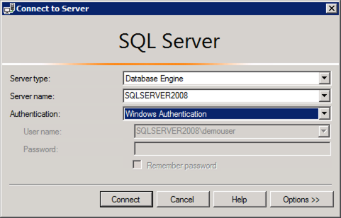

6. In SSMS, select the **Open File** icon in SSMS menu bar.

   

7. In the Open File dialog, browse to the `C:\AdventureWorksSample\AdventureWorks 2008R2 Data Warehouse\` folder, select the file named `instawdwdb.sql`, and then select **Open**.

   

8. Next, select **Tools** in the SSMS menu, then select **Options**.

   

9. In the Options dialog, expand **Text Editor** in the tree view on the left, then expand **Transact-SQL**, select **General**, then check the box next to **Line numbers**. This will display line numbers in the query editor window, to make finding the lines specified below easier.

   

10. Select **OK** to close the Options dialog.

11. In the SSMS query editor for `instawdwdb.sql`, uncomment the `SETVAR` lines (lines 36 and 37) by removing the double hyphen "--" from the beginning of each line.

12. Next, edit the file path for each variable so they point to the following (remember to include a trailing backslash ("\\") on each path):

    - SqlSamplesDatabasePath: `C:\AdventureWorksSample\`

    - SqlSamplesSourceDataPath: `C:\AdventureWorksSample\AdventureWorks 2008R2 Data Warehouse\`

      

13. Place SSMS into **SQLCMD mode** by selecting it from the **Query** menu.

    

14. Execute the script by selecting the **Execute** button on the toolbar in SSMS.

    

15. This will create the `AdventureWorksDW2008R2` database. When the script is done running, you will see output similar to the following in the results pane.

    

16. Expand **Databases** in Object Explorer, right-click the `AdventureWorksDW2008R2` database, and select **Rename**.

    

17. Set the name of the database to `WorldWideImporters`.

    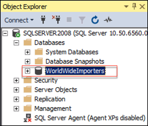

18. Close SSMS.

### Task 3: Update SQL Server settings using Configuration Manager

In this task, you will update the SQL Server service accounts and other settings associated with the SQL Server instance installed on the VM.

1. From the Start Menu on your SqlServer2008 VM, search for **SQL Server Config**, then select **SQL Server Configuration Manager** from the search results.

   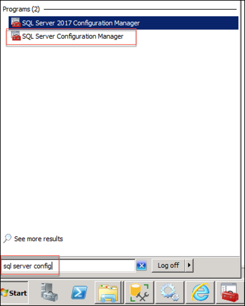

2. From the tree on the left of the Configuration Manager window, select **SQL Server Services**, and then double-click **SQL Server (MSSQLSERVER)** in the list of services to open its properties dialog.

   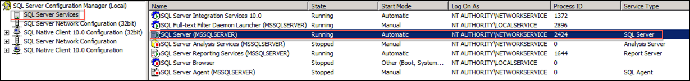

3. In the SQL Server (MSSQLSERVER) Properties dialog, change **Log on as** to use the demouser account, by entering **demouser** into the Account Name box, then entering the password, **Password.1!!**, into the Password and Confirm password boxes.

   

4. Select **OK**.

5. Select **Yes** to restart the service in the **Confirm Account Change** dialog.

6. While still in the SQL Server Configuration Manager, expand **SQL Server Network Configuration**, select **Protocols for MSSQLSERVER**, and double-click **TCP/IP** to open the properties dialog.

   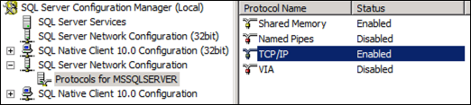

7. On the TCP/IP Properties dialog, ensure **Enabled** is set to **Yes**, and select **OK**.

   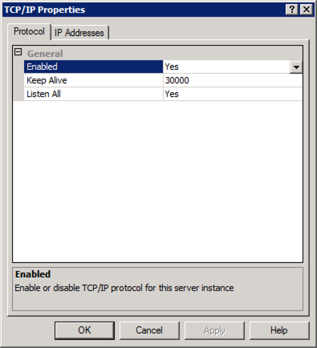

   > **Note**: If prompted that the changes will not take effect until the service is restarted, select **OK**. You will restart the service later.

8. Select **SQL Server Services** in the tree on the left, then right-click **SQL Server (MSSQLSERVER)** in the services pane, and select **Restart**.

   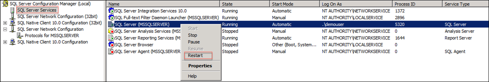

9. Repeat the previous step for the **SQL Server Agent (MSSQLSERVER)** service, this time selecting **Start** from the menu.

   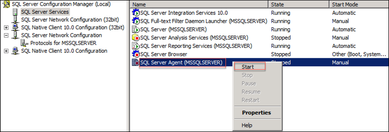

10. Close the SQL Server Configuration Manager.

### Task 4: Connect to the SqlServer2017 VM

In this task, you will create an RDP connection to the SqlServer2017 VM.

1. In the [Azure portal](https://portal.azure.com), select **Resource groups** in the Azure services list, enter your resource group name (hands-on-lab-SUFFIX) into the filter box, and select it from the list.

   

2. In the list of resources for your resource group, select the SqlServer2017 VM.

   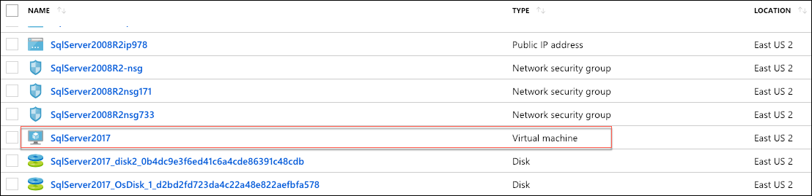

3. On the SqlServer2017 blade, select Connect from the top menu.

   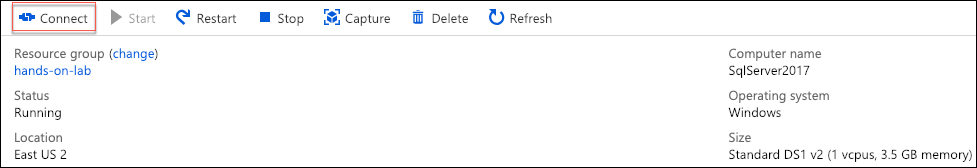

4. Select **Download RDP file**, then open the downloaded RDP file.

   

5. Select **Connect** on the Remote Desktop Connection dialog.

   

6. Enter the following credentials when prompted:

   - **Username**: demouser
   - **Password**: Password.1!!

7. Select **Yes** to connect, if prompted that the identity of the remote computer cannot be verified.

   

### Task 5: Update SQL Server settings using Configuration Manager 2017

In this task, you will update the SQL Server 2017 service accounts and other settings associated with the SQL Server 2017 instance installed on the VM.

1. From the Search Menu on your SqlServer2017 VM, search for **SQL Server 2017 Configuration Manager**, then select it from the search results.

   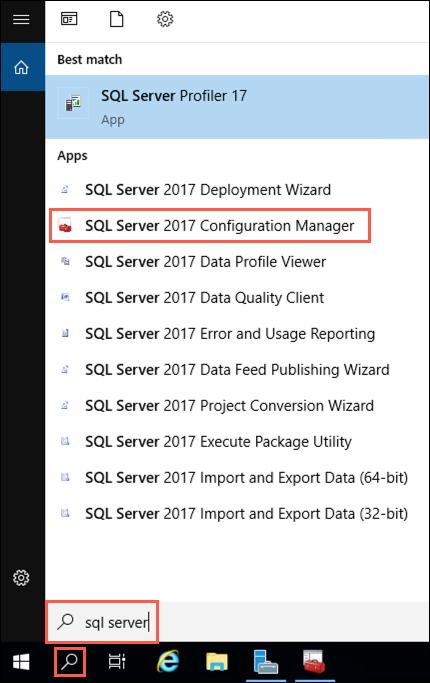

2. From the tree on the left of the Configuration Manager window, select **SQL Server Services**.

   

3. In the list of services, double-click **SQL Server (MSSQLSERVER)** to open its properties dialog.

   ")

4. In the SQL Server (MSSQLSERVER) Properties dialog, change the **Log On user** to use the demouser account, by entering **demouser** into the Account Name box, then entering the password, **Password.1!!**, into the Password and Confirm password boxes.

   

5. Select **OK**.

6. Select **Yes** to restart the service in the **Confirm Account Change** dialog.

7. While still in the SQL Server 2017 Configuration Manager, expand **SQL Server Network Configuration**, select **Protocols for MSSQLSERVER**, and double-click **TCP/IP** to open the properties dialog.

   

8. On the TCP/IP Properties dialog, verify **Enabled** is set to **Yes**, and select **OK**.

   

   > **Note**: If TCP/IP was not already enabled, you will be prompted that the changes will not take effect until the service is restarted, select **OK**. Restart the service by selecting **SQL Server Services** in the tree on the left, then right-clicking **SQL Server (MSSQLSERVER)** in the services pane, and selecting **Restart**.

9. Select **SQL Server Services** in the tree on the left, right-click the **SQL Server Agent (MSSQLSERVER)** service, and then select **Start** from the menu.

   

10. Close the SQL Server 2017 Configuration Manager.
