## Exercise 2: Migrate SQL Server to Azure SQL Database using DMS

Duration: 60 minutes

World Wide Importers would like a Proof of Concept (POC) that moves their data warehouse to Azure SQL Database. They would like to know about any incompatible features that might block their eventual production move. In this exercise, you will use the [Azure Database Migration Service](https://azure.microsoft.com/services/database-migration/) (DMS) to perform an assessment on their SQL Server 2008 R2 data warehouse database, and then migrate the WorldWideImporters database from the "on-premises" SQL Server 2008 R2 instance to [Azure SQL Database](https://docs.microsoft.com/azure/sql-database/).

### Task 1: Assess the on-premises database

World Wide Importers would like an assessment to see what potential issues they would have to address in moving their database to Azure SQL Database.

1. On the SqlServer2008 VM, download the [Data Migration Assistant v5.x](https://www.microsoft.com/download/confirmation.aspx?id=53595) and run the downloaded installer.

2. Select **Next** on each of the screens, accepting to the license terms and privacy policy in the process.

3. Select **Install** on the Privacy Policy screen to begin the installation.

4. On the final screen, check the **Launch Microsoft Data Migration Assistant** check box, and select **Finish**.

   

5. In the Data Migration Assistant window, select the New **(+)** icon in the left-hand menu.

   

6. In the New project dialog, enter the following:

   - **Project type**: Select Assessment.
   - **Project name**: Enter Assessment.
   - **Assessment type**: Select Database Engine.
   - **Source server type**: Select SQL Server.
   - **Target server type**: Select Azure SQL Database.

   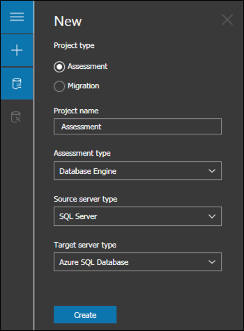

   - Select **Create**.

7. On the **Options** tab, ensure the **Check database compatibility** and **Check feature parity** report types are checked, and select **Next**.

   

8. In the **Connect to a server** dialog on the **Select sources** tab, enter `SQLSERVER2008` into the Server name box, and **uncheck Encrypt connection**, then select **Connect**.

   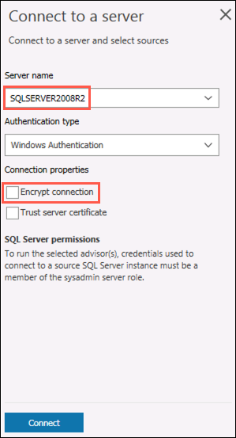

9. In the **Add sources** dialog that appears, check the box next to **WorldWideImporters**, and select **Add**.

   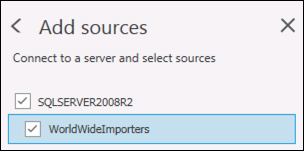

10. Select **Start Assessment**.

11. Review the Assessment results, selecting both **SQL Server feature parity** and **Compatibility issues** options and viewing the reports.

    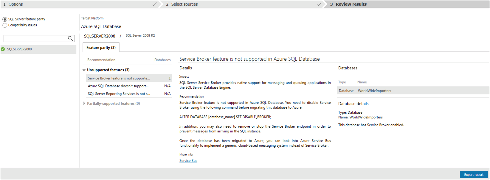

12. You now have a list of the issues WWI will need to consider in upgrading their database to Azure SQL Database. Notice the assessment includes recommendations on the potential resolutions to issues. You can select **Export Assessment** on the top toolbar to save the report as a JSON file, if desired.

### Task 2: Migrate the database schema

After you have reviewed the assessment results and you have ensured the database is a candidate for migration to Azure SQL Database, use the Data Migration Assistant to migrate the schema to Azure SQL Database.

1. On the SqlServer2008 VM, return to the Data Migration Assistant, and select the New **(+)** icon in the left-hand menu.

2. In the New project dialog, enter the following:

   - **Project type**: Select Migration.
   - **Project name**: Enter DwMigration.
   - **Source server type**: Select SQL Server.
   - **Target server type**: Select Azure SQL Database.
   - **Migration scope**: Select Schema only.

   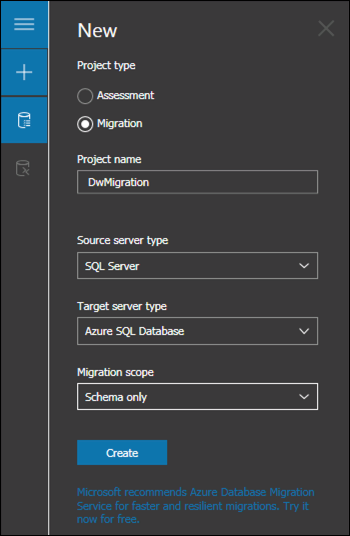

3. Select **Create**.

4. On the **Select source** tab, enter the following:

   - **Server name**: Enter SQLSERVER2008.
   - **Authentication type**: Leave Windows Authentication selected.
   - **Connection properties**: Check both Encrypt connection and Trust server certificate.
   - Select **Connect**.
   - Select **WorldWideImporters** from the list of databases.

   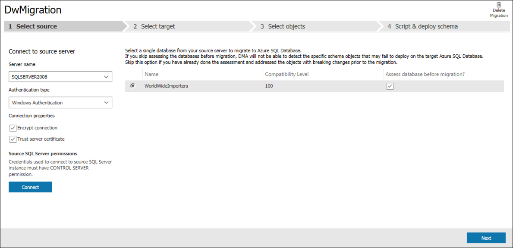

5. Select **Next**.

6. On the **Select target** tab, enter the following:

   - **Server name**: Enter the server name of the Azure SQL Database you created during the before the hands-on lab exercise.
     - To find the name of your SQL Database, select the WorldWideImporters SQL Database from your hands-on-lab-SUFFIX resource group in the Azure portal, and then select the **Server name** in the Essentials area of the Overview blade.

   

   - **Authentication type**: Select SQL Server Authentication.
   - **Username**: Enter demouser.
   - **Password**: Enter Password.1!!
   - **Connection properties**: Check both Encrypt connection and Trust server certificate.
   - Select **Connect**.
   - Select **WorldWideImporters** from the list of databases.

   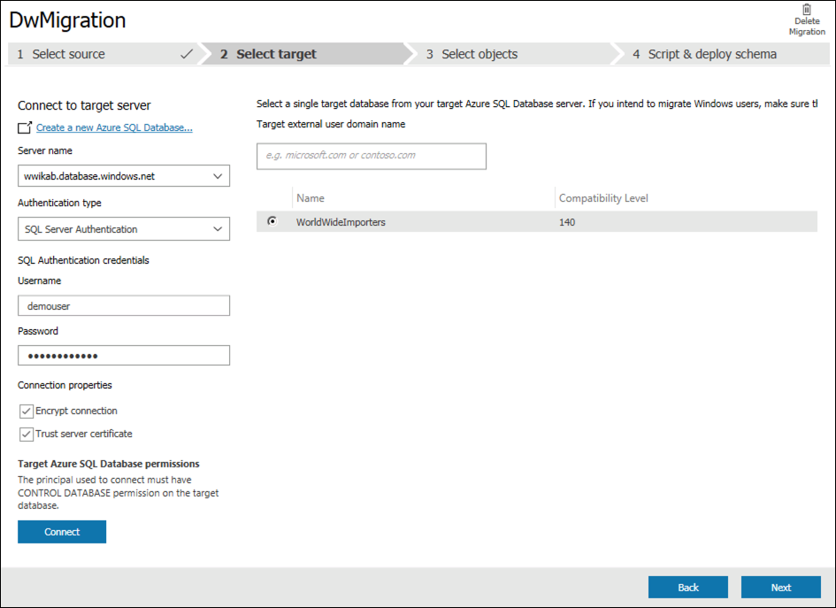

7. Select **Next**.

8. In the **Select objects** tab, leave all the objects checked, and select **Generate SQL script**.

   

9. In the **Script & deploy schema** tab, review the script, then select **Deploy schema**.

   

10. Select **Deploy schema**.

11. After the schema is deployed, review the deployment results, and ensure there were no errors.

    

12. Next, open SSMS on the SqlServer2008 VM, and connect to your Azure SQL Database, by selecting **Connect->Database Engine** in the Object Explorer, and then entering the server name and credentials into the Connect to Server dialog.

    

13. Once connected, expand **Databases**, and expand **WorldWideImporters**, then expand **Tables**, and observe the schema has been created.

    

### Task 3: Create a migration project

In this task, you will create a new migration project for the WorldWideImporters database.

1. Navigate to the Azure Database Migration Service in the [Azure portal](https://portal.azure.com).

2. On the Azure Database Migration Service blade, select **+New Migration Project**.

   

3. On the New migration project blade, enter the following:

   - **Project name**: Enter OnPremToAzureSql.

   - **Source server type**: Select SQL Server.

   - **Target server type**: Select Azure SQL Database.

   - **Choose type of activity**: Select Create project only and select **Save**.

     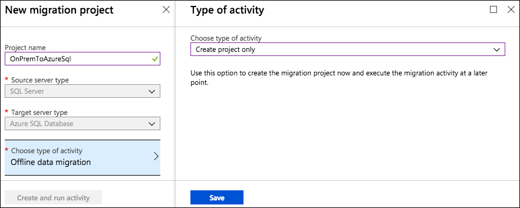

4. Select **Create**.

5. On the Migration Wizard **Select source** blade, enter the following:

   - **Source SQL Server instance name**: Enter the IP address of your SqlServer2008 VM. For example, `40.84.6.199`.

     - You can retrieve the VM IP address by navigating to the SqlServer2008 overview blade in the Azure portal and selecting the copy button next to the Public IP address value.

       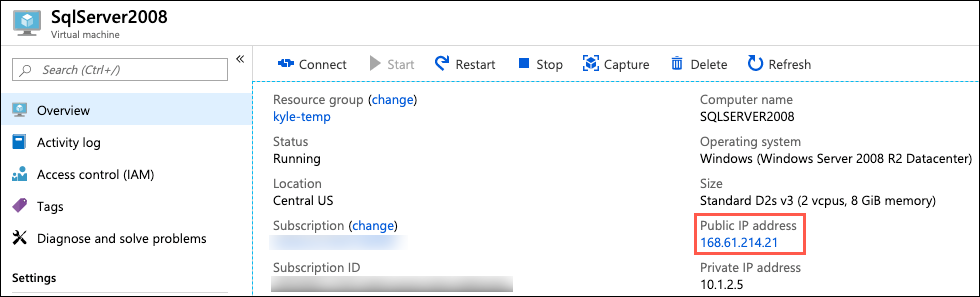

   - **Authentication type**: Select SQL Authentication.
   - **Username**: Enter **demouser**
   - **Password**: Enter **Password.1!!**
   - **Connection properties**: Check both Encrypt connection and Trust server certificate.

   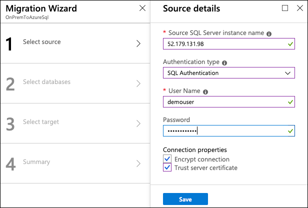

6. Select **Save**.

7. On the Migration Wizard **Select source databases** blade, select WorldWideImporters.

   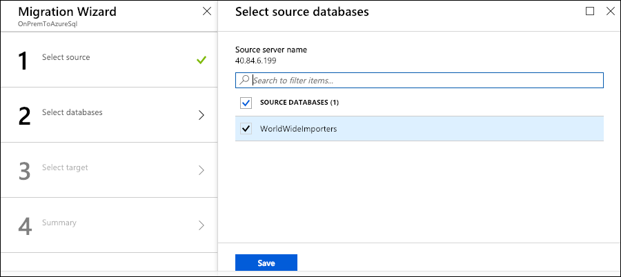

8. Select **Save**.

9. On the Migration Wizard **Select target** blade, enter the following:

   - Select **I know my target details**.
   - **Target server name**: Enter the server name for your Azure SQL Database.

     - To find the name of your SQL Database, select the WorldWideImporters SQL Database from your hands-on-lab-SUFFIX resource group in the Azure portal, and then select the **Server name** in the Essentials area of the Overview blade.

       

   - **Authentication type**: Select SQL Authentication.
   - **Username**: Enter **demouser**
   - **Password**: Enter **Password.1!!**
   - **Connection properties**: Check Encrypt connection.

   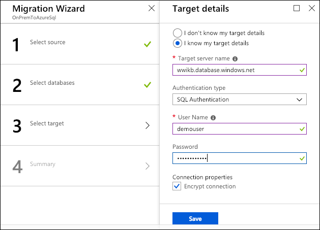

10. Select **Save**.

11. On the Migration Wizard Summary blade, review the Project summary, then select **Save**.

    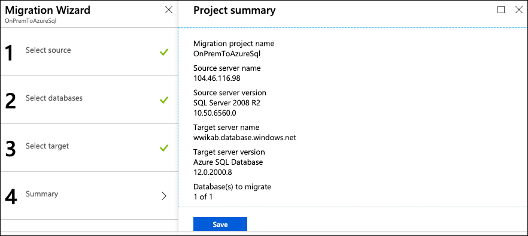

12. On the Azure Database Migration Project blade, you will receive a success message, similar to the following.

    

### Task 4: Run the migration

In this task, you will create a new activity in the Azure Database Migration Service to execute the migration from the "on-premises" SQL Server 2008 R2 server to Azure SQL Database.

1. On the Azure Database Migration Service blade, select **+New Activity**, and then select **Offline data migration**.

   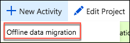

2. On the Migration Wizard **Select source** blade, re-enter the demouser password, **Password.1!!**, then select **Save**.

   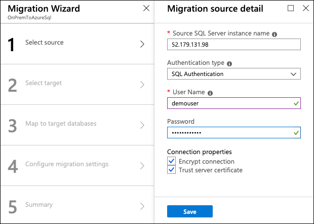

3. On the Migration Wizard **Select target** blade, re-enter the demouser password, **Password.1!!**, then select **Save**.

   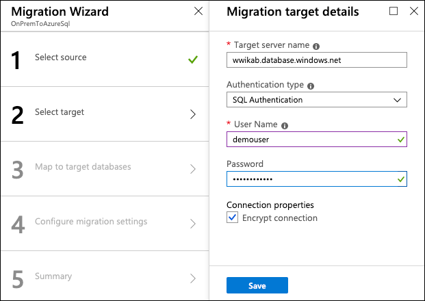

4. On the Migration Wizard **Map to target databases** blade, confirm that **WorldWideImporters** is checked as the source database, and that it is also the target database on the same line, then select **Save**.

   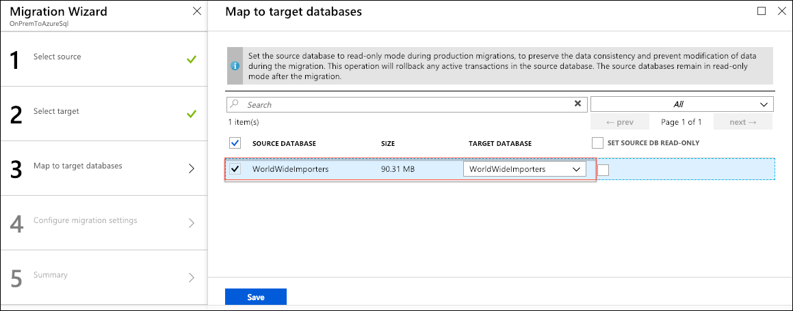

5. On the Migration Wizard **Configure migration settings** blade, expand the WorldWideImporters database, verify all the tables are selected, and select **Save**.

   

6. On the Migration Wizard **Summary** blade, enter the following:

   - **Activity name**: Enter a name, such as Sql2008ToSqlDatabase.

   - **Validation option**: Select Validate my database(s), check all three Validation options, and then select **Save**.

     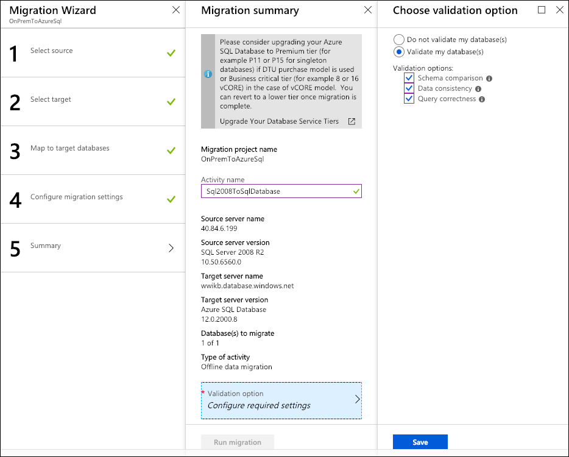

7. Select **Run migration**.

8. Monitor the migration on the status screen that appears. Select the refresh icon in the toolbar to retrieve the latest status.

   

9. When the migration is complete, you will see the status as **Completed**.

   

### Task 5: Verify data migration

In this task, you will use SSMS to verify the database was successfully migrated to Azure SQL Database.

1. Open SSMS on the SqlServer2008 VM, and connect to your Azure SQL Database. In the Connect to Server dialog, enter the following:

   - **Server name**: Enter the server name of your Azure SQL Database.
   - **Authentication**: Select SQL Server Authentication.
   - **Login**: Enter demouser.
   - **Password:**: Enter Password.1!!

   

2. Select **Connect**.

3. In the Object Explorer, expand Databases, WorldWideImporters, and Tables, then right-click `dbo.DimCustomer`, and choose **Select Top 1000 Rows**.

   

4. Observe that the query returns results, showing the data has been migrated from the on-premises SQL Server 2008 R2 database into Azure SQL Database.

5. Leave SSMS open with the connection to your Azure SQL Database for the next exercise.
