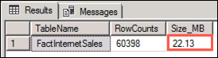
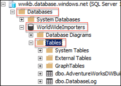

## Exercise 3: Post upgrade enhancement

Duration: 20 minutes

In this exercise, you will demonstrate value from the upgrade by enabling the Table Compression and ColumnStore Index features of Azure SQL Database.

### Task 1: Table compression

1. In SSMS on the SqlServer2008 VM, and connect to your Azure SQL Database.

2. Open a new query window by selecting **New Query** from the toolbar.

   

3. Copy the script below, and paste it into the query window:

   ```sql
   USE [WorldWideImporters]

   -- Get the Size of the FactInternetSales table
   SELECT
   t.Name AS TableName,
   p.rows AS RowCounts,
   CAST(ROUND((SUM(a.total_pages) / 128.00), 2) AS NUMERIC(36, 2)) AS Size_MB
   FROM sys.tables t
   INNER JOIN sys.indexes i ON t.OBJECT_ID = i.object_id
   INNER JOIN sys.partitions p ON i.object_id = p.OBJECT_ID AND i.index_id = p.index_id
   INNER JOIN sys.allocation_units a ON p.partition_id = a.container_id
   WHERE t.Name = 'FactInternetSales'
   GROUP BY t.Name, p.Rows
   GO
   ```

4. Select **Execute** on the toolbar to run the query to retrieve the size of the `FactInternetSales` table.

   

5. In the results pane, note the size of the `FactInternetSales` table.

   

6. In the Object Explorer, expand Databases, WorldWideImporters, and Tables.

   

7. Right-click the `FactInternetSales` table, select the **Storage** context menu, and then select **Manage Compression** from the fly-out menu.

   

8. On the Welcome page of the Data Compression Wizard, select **Next**.

9. On the Select Compression Type page, select **Row** from the Compression Type drop down, and select **Next**.

   

10. On the Select an Output Option page, select **Run immediately**, and then select **Finish >>|**.

    

11. Select **Finish** on the Summary page.

    

12. Close the Data Compression Wizard, and rerun the query to get the size of the `FactInternetSales` table, noting the reduced size of the table.

    

13. Now, repeat steps 7 - 12 above, this time setting the Compression type to Page.

    

14. Once again, observe the table size in the results pane, and compare it to the values noted for the uncompressed table and with Row compression applied.

    

15. Both Row and Page compression reduce the size of the table, but Page compression provides the greatest reduction in this case. Compression decreases the load on the Disk I/O subsystem, while increasing the load on the CPU. Since most data warehouse workloads are heavily disk bound, and often have low CPU usage, compression can be a great way to improve performance.

### Task 2: Clustered ColumnStore index

In this task, you will create a new table based on the existing `FactResellerSales` table and apply a ColumnStore index.

1. In SSMS, ensure you are connected to the Azure SQL Database instance.

2. Open a new query window by selecting **New Query** from the toolbar.

   

3. Copy the script below, and paste it into the query window:

   ```sql
   USE WorldWideImporters

   SELECT *
   INTO ColumnStore_FactResellerSales
   FROM FactResellerSales
   GO
   ```

4. Select **Execute** on the toolbar to run the query, and create a new table named `ColumnStore_FactResellerSales`, populated with data from the `FactResellerSales` table.

   

5. Select **New Query** in the toolbar again, and paste the following query into the new query window. The query contains multiple parts; one to get the size of the `ColumnStore_FactResellerSales` table, a second to create a clustered ColumnStore index on the ColumnStore_FactResellerSales table, and then the size query is repeated to get the size after adding the clustered ColumnStore index.

   ```sql
   USE [WorldWideImporters]

   -- Get the Size of the ColumnStore_FactResellerSales table
   SELECT
   t.Name AS TableName,
   p.rows AS RowCounts,
   CAST(ROUND((SUM(a.total_pages) / 128.00), 2) AS NUMERIC(36, 2)) AS Size_MB
   FROM sys.tables t
   INNER JOIN sys.indexes i ON t.OBJECT_ID = i.object_id
   INNER JOIN sys.partitions p ON i.object_id = p.OBJECT_ID AND i.index_id = p.index_id
   INNER JOIN sys.allocation_units a ON p.partition_id = a.container_id
   WHERE t.Name = 'ColumnStore_FactResellerSales'
   GROUP BY t.Name, p.Rows
   GO

   -- Create a clustered columnstore index on the ColumnStore_FactResellerSales table
   CREATE CLUSTERED COLUMNSTORE INDEX [cci_FactResllerSales]
   ON [dbo].[ColumnStore_FactResellerSales]
   GO

   -- Get the Size of the ColumnStore_FactResellerSales table
   SELECT
   t.Name AS TableName,
   p.rows AS RowCounts,
   CAST(ROUND((SUM(a.total_pages) / 128.00), 2) AS NUMERIC(36, 2)) AS Size_MB
   FROM sys.tables t
   INNER JOIN sys.indexes i ON t.OBJECT_ID = i.object_id
   INNER JOIN sys.partitions p ON i.object_id = p.OBJECT_ID AND i.index_id = p.index_id
   INNER JOIN sys.allocation_units a ON p.partition_id = a.container_id
   WHERE t.Name = 'ColumnStore_FactResellerSales'
   GROUP BY t.Name, p.Rows
   GO
   ```

6. Select **Execute** on the toolbar to run the query.

7. In the query results, observe the `Size_MB` value of the table before and after the creation of the clustered ColumnStore index. The first value is the size before the index was created, and the second value is the size after the ColumnStore index was created.

   

8. Create a new query window by selecting **New Query** from the toolbar, and select **Include Actual Execution Plan** by selecting its button in the toolbar.

   

9. Paste the queries below into the new query window, and select **Execute** on the toolbar:

   ```sql
   SELECT productkey, salesamount
   FROM ColumnStore_FactResellerSales

   SELECT productkey, salesamount
   FROM FactResellerSales
   ```

10. In the Results pane, select the **Execution Plan** tab. Check the (relative to the batch) percentage value of the two queries and compare them.

    

11. Run the same queries again, but this time set statistics IO on in the query by adding the following to the top of the query window:

    ```sql
    SET STATISTICS IO ON
    GO
    ```

12. Your query should look like:

    

13. Select **Execute** from the toolbar to run the query.

14. Statistics IO reports on the amount of logical pages that are read in order to return the query results. Select the **Messages** tab of the Results pane, and compare two numbers, logical reads and lob logical reads. You should see a significant drop in total number of logical reads on the columns store table.

    

15. You are now down with the SqlServer2008 VM.
