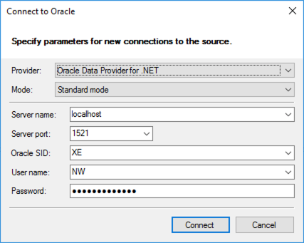
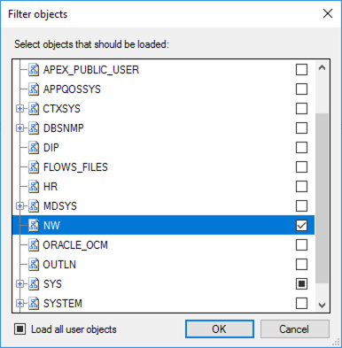
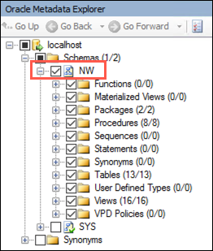
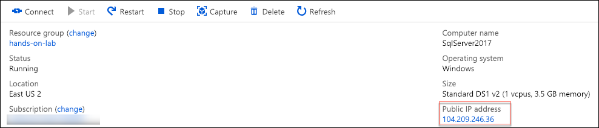
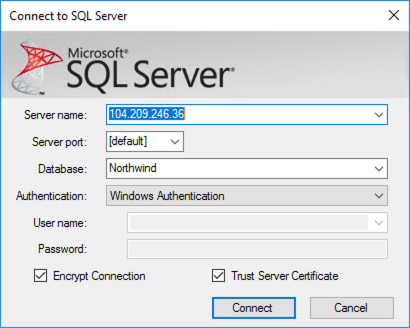
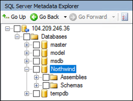
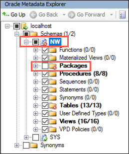
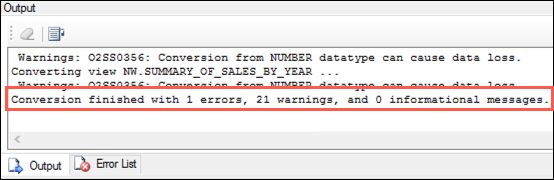

## Exercise 5: Migrate the Oracle database to SQL Server 2017

Duration: 30 minutes

In this exercise, you will migrate the Oracle database into the "on-premises" SQL Server 2017 instance using SSMA.

### Task 1: Migrate the Oracle database to SQL Server 2017 using SSMA

1. On your LabVM, launch **Microsoft SQL Server Migration Assistant for Oracle** from the Start Menu.

2. Select **File**, then **New Project...**

   

3. In the New Project dialog, accept the default name and location, select **SQL Server 2017** for the Migration To value, and select **OK**.

   

4. Select **Connect to Oracle** in the SSMA toolbar.

   

5. In the Connect to Oracle dialog, enter the following:

   - **Provider**: Leave set to the default value, Oracle Client Provider for .NET.
   - **Mode**: Leave set to Standard mode.
   - **Server name**: Enter localhost.
   - **Server port**: Set to 1521.
   - **Oracle SID**: Enter XE.
   - **Username**: Enter NW.
   - **Password**: Enter oracledemo123

   

6. Select **Connect**.

7. In the Filter objects dialog, uncheck everything except the **NW**, **Sys**, and **System** databases.

   

8. In the Output window, you will see a message that the connection was established successfully, similar to the following:

   

9. Under Oracle Metadata Explorer, expand the localhost node, Schemas, and confirm you can see the NW schema, which will be the source for the migration.

   

10. Next, select **Connect to SQL Server** from the toolbar, to add your SQL 2017 connection.

    

11. In the connect to SQL Server dialog, provide the following:

    - **Server name**: Enter the IP address of your SqlServer2017 VM. You can get this from the Azure portal by navigating to your VM's blade, and looking at the Essentials area.

    

    - **Server port**: Leave set to [default].
    - **Database**: Enter Northwind.
    - **Authentication**: Set to Windows Authentication.

    

12. Select **Connect**.

13. You will see a success message in the output window.

    

14. In the SQL Server Metadata Explorer, expand the server node, then Databases. You should see Northwind listed.

    

15. In the Oracle Metadata Explorer, check the box next to NW, expand the NW database, and uncheck **Packages**. Next, select NW to make sure it is selected in the tree.

    

16. In the SQL Server Metadata explorer, check the box next to Northwind.

    

17. In the SSMA toolbar, select **Convert Schema**. There is a bug in SSMA which prevents this button to being properly enabled, so if the button is disabled, you can select the NW node in the Oracle Metadata Explorer, which should cause the Convert Schema button to become enabled. You can also right-click on the NW database in the Oracle Metadata Explorer, and select Convert Schema if that does not work.

    

18. After about a minute the conversion should have completed.

19. In the SQL Server Metadata Explorer, observe that new schema objects have been added. For example, under Northwind, Schemas, NW, Tables you should see the tables from the Oracle database.

    

20. In the output pane, you will notice a message that the conversion finished with 1 error, and 21 warnings.

    

21. To view the errors, select the **Error List** at the bottom of the SSMA screen.

    

22. Select **Warnings** to hide the warnings, and leave only Errors displayed.

    

23. Double-click on the error listed. This will display the Table in both Oracle and SQL Server that is causing the error, `EMPLOYEETERRITORIES`. Notice the Oracle table lists `EMPLOYEEID` with a data type of `NUMBER`, while SQL Server is expecting a data type of `float(53)`.

    

24. Look at the table definition for the table on the Oracle side.

25. To change the data type, select the **Type Mapping** tab, select the row with source type of number, and select **Edit**.

    

26. In the Edit Type Mapping dialog, set the Target type to **numeric(precision, scale)**, set the Precision to **10**, and select **OK**.

    

27. Select **Apply** on the Type mapping tab.

    

28. In the Oracle Metadata Explorer, right-click the `EMPLOYEETERRITORIES` table, and select **Convert Schema**.

    

29. When prompted that the target exists, select **Overwrite**.

    

30. Notice the error is now gone from the Error List.

31. We are going to fix another data type conversion issue now, which will otherwise appear when we attempt to migrate the data.

32. Select the `ORDER_DETAILS` table in the Oracle Metadata Explorer.

    

33. Next, you are going to convert the type associated with the `DISCOUNT` column, `FLOAT(23)` to a `numeric(10, 0)`, similar to what you did for the `EMPLOYEETERRITORIES` table.

34. Select the **Type Mapping** tab, then select `float[*..53]` from the Source Type list, and select **Edit**.

    ![The row with source type of float[*..53] is selected and highlighted on the Type Mapping tab, and Edit is highlighted on the right.](./media/ssma-type-mapping-float-edit.png "Edit float[*..53]")

35. In the Edit Type Mapping dialog, change the Target type to `numeric(precision, scale)`, and set the Precision to **10**, then select **OK**.

    

36. Select **Apply** to save the changes to the `ORDER_DETAILS` table.

37. Now, right-click on the `ORDER_DETAILS` table in the Oracle Metadata Explorer, and select **Convert Schema**.

38. When prompted that the target exists, select **Overwrite**.

39. **Optional**: Save the project. This can take a while, and is not necessary to complete the hands-on lab.

40. To apply the resultant schema to the Northwind database in SQL Server, use the SQL Server Metadata Explorer to view the Northwind database. Right-click Northwind, and select **Synchronize with Database**.

    

41. Select **OK** in the Synchronize with the Database dialog.

42. The Synchronize action will result in multiple errors in the Error List, resulting from attempting to add the SSMA assemblies to the Northwind database.

    

43. These errors are the result of improvements implemented in SQL Server 2017 SQLCLR security model. Specifically, in SQL Server 2017, Microsoft now by default requires that all types of assemblies (SAFE, EXTERNAL_ACCESS, UNSAFE) are authorized for UNSAFE access.

44. For this hands-on lab, you will be adding the assemblies causing the errors to the trusted assembly list, which is synonymous with white-listing the assemblies. To fix these errors, complete the following:

    - Under the **Northwind** database in the SQL Server Metadata Explorer in SSMA, expand **Assemblies**.

    

    - Right-click `SSMA4OracleSQLServerCollections.NET`, and select **Save as Script**.

    

    - Save the script to the local machine.
    - Now, you will need to use SSMS on your SqlServer2017 VM.

      - Open an RDP connection to your SqlServer2017 VM, if one is not already open.
      - Open SSMS 17.
      - Connect to SqlServer2017, by entering **SqlServer2017** into the Server name field, using Windows Authentication, and selecting **Connect**.
      - Expand **Databases**, right-click on **Northwind**, and select **New Query**.
      - Paste the following query into the new query window, but don't execute it until you complete the steps below:

      ```sql
      USE master;
      GO

      DECLARE @clrName nvarchar(4000) = 'SSMA4OracleSQLServerCollections.NET'
      DECLARE @asmBin varbinary(max) = [INSERT BINARY];
      DECLARE @hash varbinary(64);

      SELECT @hash = HASHBYTES('SHA2_512', @asmBin);

      EXEC sys.sp_add_trusted_assembly @hash = @hash, @description = @clrName;
      ```

    - Now, return to your Lab VM, and open the saved `SSMA4OracleSQLServerCollections.NET.sql` file from the desktop with Notepad.exe.
    - Within the SQL file, locate the line that begins with `CREATE ASSEMBLY`, then locate the word `FROM`. Copy the binary string that appears after `FROM`. This value will span all the way down to the line containing the text `WITH PERMISSION_SET = SAFE`. Be sure not to include any whitespace at the end of the binary value.

      

    - Now, return to SSMS on your SqlServer2017 VM, and replace `INSERT BINARY` with the copied binary value. The line should end with ";" and there should be no whitespace before the ";".
    - Execute the query in SSMS.

45. Repeat step 44, this time for the assembly `SSMA4OracleSQLServerExtensions.NET`. Make sure to replace the `@clrName` variable in the script with the value "SSMA4OracleSQLServerExtensions.NET".

46. The SSMA assemblies have now been whitelisted in SQL Server 2017.

47. Return to SSMA on your Lab VM, and rerun the **Synchronize with Database** action on the Northwind database. This will create all the schema objects in the SQL Server Northwind database. There should now be no errors, and the Output pane should show **Synchronization operation is complete**.

48. Now you need to migrate the data.

49. In the Oracle Metadata Explorer, select **NW** and from the command bar, select **Migrate Data**.

    

50. You will be prompted to re-enter your Oracle credentials for use by the migration connection.

    - Recall the Oracle credentials are:

      - **Server name**: localhost
      - **Server port**: 1521
      - **Oracle SID**: XE
      - **Username**: NW
      - **Password**: oracledemo123

    - The SQL Server credentials are:

      - **Server name**: IP address of your SqlServer2017 VM (obtained in the essentials area of your VM's blade in Azure portal).
      - **Server port**: [default]
      - **Authentication**: Windows Authentication

51. Select **Connect**.

52. After the migration completes, you will be presented with a Data Migration Report, similar to the following:

    

53. Select **Close** on the migration report.

54. Close SSMA for Oracle.
