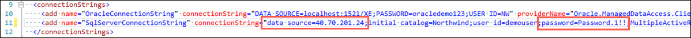
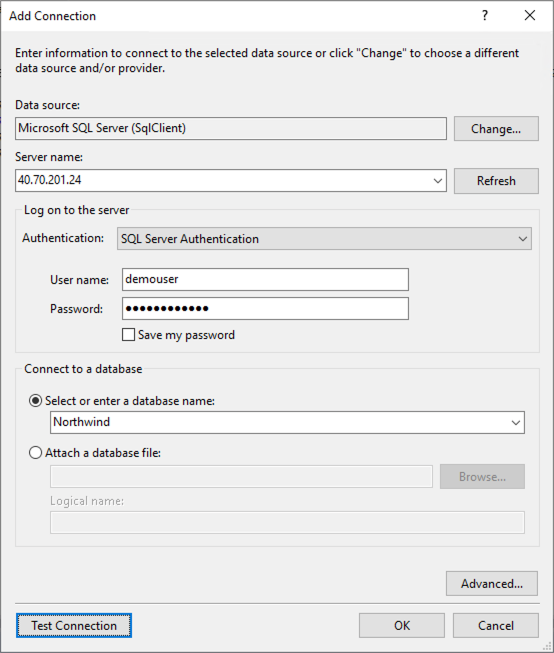

## Exercise 6: Migrate the Application

Duration: 15 minutes

In this exercise, you will modify the `NorthwindMVC` application so it targets SQL Server 2017 instead of Oracle.

### Task 1: Create a new Entity Model against SQL Server

1. On your Lab VM, return to Visual Studio, and open `Web.config` from the Solution Explorer.

2. Modify the connection string named `SqlServerConnectionString` to match your remote SQL Server credentials.

   - Replace the value of "data source" with your SqlServer2017 VM's public IP address.
   - Verify the value of "password" is **Password.1!!**

   

3. Save the `web.config` file.

4. Build the solution, by selecting Build in the Visual Studio menu, then selecting Build Solution.

5. In the Solution Explorer, expand the Data folder, and select all the files within the folder.

   

6. Right-click, and choose **Delete**.

   

7. Select **OK** at the confirmation prompt.

8. Right-click on the Data folder, and select **Add > New Item...**

   

9. In the Add New Item dialog, expand Visual C#, select **Data**, and select **ADO.NET Entity Data Model**. Enter **DataContext** for the name, and select **Add**.

   

10. In the wizard's Choose Model Contents dialog, select **Code First from database**, and select **Next**.

    

11. In the Choose Your Data Connection dialog:

    - Select **SqlServerConnectionString (Settings)** from the data connection drop down.
    - Select **Yes, include the sensitive data in the connection string**.
    - **Uncheck Save connection settings in Web.Config**.
    - Select **Next**.

    

12. If prompted, in the Connect to SQL Server dialog, enter the Password, **Password.1!!**

    

13. On the Choose Your Database Objects and Settings screen, expand the Tables node, and check **NW** only. Ensure **Pluralize or singularize generated column names** is checked.

    

14. Select **Finish**, and the model will be generated. This may take a few minutes.

### Task 2: Modify Application Code

1. In Visual Studio, open the file `DataContext.cs` from the Solution Explorer. You may need to collapse the Data folder, and re-expand it after refreshing if you don't see the file listed

   

2. The call to base in the DataContext constructor, at the top of the file, needs to be updated to reflect the correct connection string.

   

3. Change the line from:

   ```csharp
   : base ("name=DataContext")
   ```

4. To:

   ```csharp
   : base ("name=SqlServerConnectionString")
   ```

5. Save the file.

   

6. Next, open the file `HomeController.cs`, in the Controllers folder in the Solution Explorer

   

7. Comment out the code under the Oracle comment. First, select the lines for the Oracle code, then select the Comment button in the toolbar.

   

8. Next, uncomment the code under the SQL Server comment. Select the commented out code, then choose the Uncomment button on the toolbar. You may need to select the Uncomment button twice to uncomment the code.

   > **Note**: The lines will change from green to colored text when the comment characters have been removed from the front of each line. This code change is done because of differences in how stored procedures are accessed in Oracle versus Sql Server.

   

9. Save the changes to `HomeController.cs`.

10. Open the file, `SALESBYYEAR.cs`, in the Models folder in the Solution Explorer.

    

11. Change the types of the following properties:

    - Change the `SUBTOTAL` property from double to decimal.

    - Change the `YEAR` property from string to int.

    

12. Save the file.

13. Open the `SalesByYearViewModel.cs` file from the Models folder in the Solution Explorer.

    

14. Change the type of the `YEAR` property from string to int, then save the file.

    

15. Run the solution by selecting the green Start button on the toolbar.

    

16. You will get an exception that the stored procedure call has failed. This is because of an error in migrating the stored procedure.

    

17. Select the red Stop button to end execution of the application.

    

18. To resolve the error, open the `SALES_BY_YEAR_fix.sql` file, located under Solution Items in the Solution Explorer.

19. From the Visual Studio menu, select **View**, and then **Server Explorer**.

    

20. In the Server Explorer, right-click on **Data Connections**, and select **Add Connections...**

    

21. On the Choose Data Source dialog, select **Microsoft SQL Server**, and select **Continue**.

    

22. On the Add Connection dialog, enter the following:

    - **Data source**: Leave Microsoft SQL Server (SqlClient).
    - **Server name**: Enter the IP address of your SqlServer2017 VM.
    - **Authentication**: Select SQL Server Authentication.
    - **Username**: Enter demouser
    - **Password**: Enter Password.1!!
    - **Connect to a database**: Choose Select or enter database name, and enter Northwind.
    - Select **Test Connection** to verify your settings are correct, and select **OK** to close the successful connection dialog.

    

23. Select **OK**.

24. Right-click the newly added SQL Server connection in the Server Explorer, and select **New Query**.

    

25. Select and copy all of the text from the `SALES_BY_YEAR_fix.sql` file (click CTRL+A, CTRL+C in the `SALES_BY_YEAR_fix.sql` file).

26. Paste (CTRL+V) the copied text into the new Query window.

27. Verify `Use [Northwind]` is the first line of the file, and that it matches the database listed in the query bar, then select the green **Execute** button.

    ![The Use [Northwind] statement is highlighted, as is the Northwind database and the Execute button in the query bar.](./media/visual-studio-sql-query-execute.png "Verify the Use [Northwind] statement")

28. You should see a message that the command completed successfully.

    

29. Run the application again by selecting the green Start button in the Visual Studio toolbar.

    

30. Verify the graph is showing correctly on the Northwind Traders dashboard.

    

31. Congratulations! You have successfully migrated the data and application from Oracle to SQL Server.
