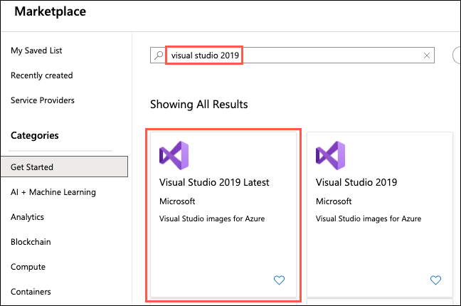
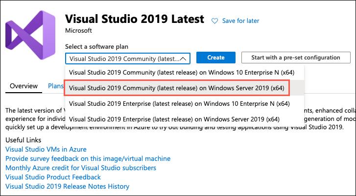
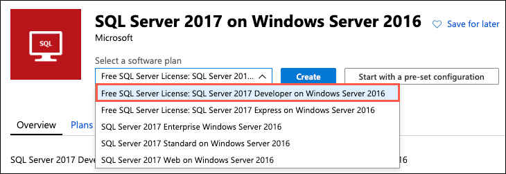
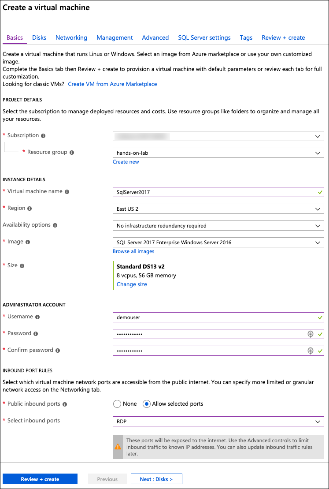
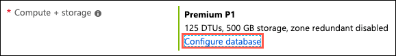
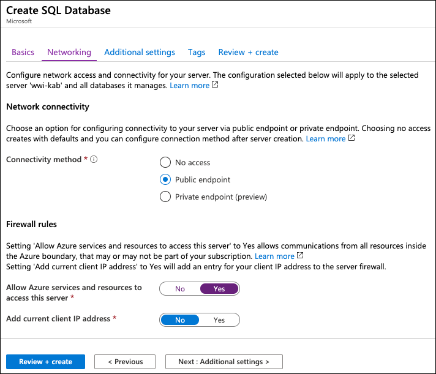
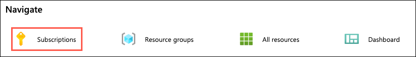
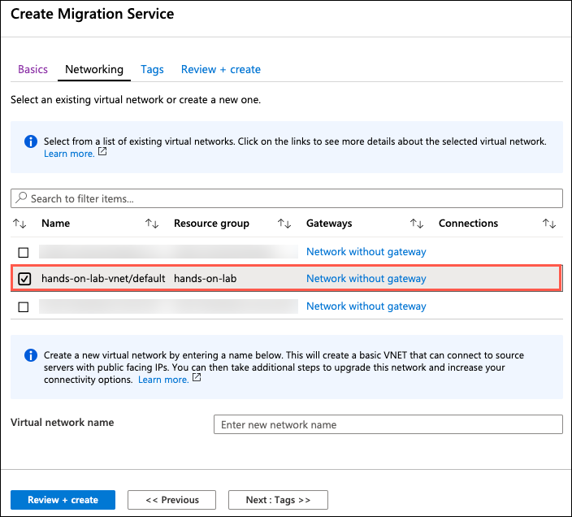

Data Platform upgrade and migration

Before the hands-on lab setup guide

November 2019

Information in this document, including URL and other Internet Web site references, is subject to change without notice. Unless otherwise noted, the example companies, organizations, products, domain names, e-mail addresses, logos, people, places, and events depicted herein are fictitious, and no association with any real company, organization, product, domain name, e-mail address, logo, person, place or event is intended or should be inferred. Complying with all applicable copyright laws is the responsibility of the user. Without limiting the rights under copyright, no part of this document may be reproduced, stored in or introduced into a retrieval system, or transmitted in any form or by any means (electronic, mechanical, photocopying, recording, or otherwise), or for any purpose, without the express written permission of Microsoft Corporation.

Microsoft may have patents, patent applications, trademarks, copyrights, or other intellectual property rights covering subject matter in this document. Except as expressly provided in any written license agreement from Microsoft, the furnishing of this document does not give you any license to these patents, trademarks, copyrights, or other intellectual property.

The names of manufacturers, products, or URLs are provided for informational purposes only and Microsoft makes no representations and warranties, either expressed, implied, or statutory, regarding these manufacturers or the use of the products with any Microsoft technologies. The inclusion of a manufacturer or product does not imply endorsement of Microsoft of the manufacturer or product. Links may be provided to third party sites. Such sites are not under the control of Microsoft and Microsoft is not responsible for the contents of any linked site or any link contained in a linked site, or any changes or updates to such sites. Microsoft is not responsible for webcasting or any other form of transmission received from any linked site. Microsoft is providing these links to you only as a convenience, and the inclusion of any link does not imply endorsement of Microsoft of the site or the products contained therein.

© 2019 Microsoft Corporation. All rights reserved.

Microsoft and the trademarks listed at <https://www.microsoft.com/en-us/legal/intellectualproperty/Trademarks/Usage/General.aspx> are trademarks of the Microsoft group of companies. All other trademarks are property of their respective owners.

## Contents

- [Data Platform upgrade and migration before the hands-on lab setup guide](#data-platform-upgrade-and-migration-before-the-hands-on-lab-setup-guide)
  - [Requirements](#requirements)
  - [Before the hands-on lab](#before-the-hands-on-lab)
    - [Task 1: Provision a resource group](#task-1-provision-a-resource-group)
    - [Task 2: Create lab virtual machine](#task-2-create-lab-virtual-machine)
    - [Task 3: Create SQL Server 2017 virtual machine](#task-3-create-sql-server-2017-virtual-machine)
    - [Task 4: Create SQL Server 2008 R2 virtual machine](#task-4-create-sql-server-2008-r2-virtual-machine)
    - [Task 5: Connect to the Lab VM](#task-5-connect-to-the-lab-vm)
    - [Task 6: Connect to the SqlServer2008 VM](#task-6-connect-to-the-sqlserver2008-vm)
    - [Task 7: Provision Azure SQL Database](#task-7-provision-azure-sql-database)
    - [Task 8: Register the Microsoft DataMigration resource provider](#task-8-register-the-microsoft-datamigration-resource-provider)
    - [Task 9: Create Azure Database Migration Service](#task-9-create-azure-database-migration-service)

# Data Platform upgrade and migration before the hands-on lab setup guide

## Requirements

- Microsoft Azure subscription must be pay-as-you-go or MSDN.
  - Trial subscriptions will not work.
- A virtual machine configured with:
  - Visual Studio 2019 Community

## Before the hands-on lab

Duration: 45 minutes

In the Before the hands-on lab exercise, you will set up your environment for use in the rest of the hands-on lab. You should follow all the steps provided in the Before the hands-on lab section to prepare your environment **before attending** the hands-on lab. Failure to do so will significantly impact your ability to complete the lab within the time allowed.

> **Important**: Most Azure resources require unique names. Throughout this lab you will see the word “SUFFIX” as part of resource names. You should replace this with your Microsoft alias, initials, or another value to ensure the resource is uniquely named.

### Task 1: Provision a resource group

In this task, you will create an Azure resource group for the resources used throughout this lab.

1. In the [Azure portal](https://portal.azure.com), select **Resource groups** from the Azure services list.

    

2. On the Resource groups blade, select **+Add**.

    

3. , then enter the following in the Create an empty resource group blade:

    - **Subscription**: Select the subscription you are using for this hands-on lab.
    - **Resource group**: Enter hands-on-lab-SUFFIX.
    - **Region**: Select the region you would like to use for resources in this hands-on lab. Remember this location so you can use it for the other resources you'll provision throughout this lab.

    

4. Select **Review + Create**.

5. On the Review + Create tab, select **Create** to provision the resource group.

### Task 2: Create lab virtual machine

In this task, you will provision a virtual machine (VM) in Azure. The VM image used will have Visual Studio Community 2019 installed.

1. In the [Azure portal](https://portal.azure.com/), select the **Show portal menu** icon and then select **+Create a resource** from the menu.

    

2. Enter "visual studio" into the Search the Marketplace box and select Visual Studio.

    

3. On the Visual Studio 2019 Latest blade, select the Select a software plan drop down list and then select **Visual Studio 2019 Community(latest release) on Windows Server 2019 (x64)** from the list.

    

4. Select **Create** on the Visual Studio 2019 Latest blade.

5. On the Create a virtual machine Basics tab, set the following configuration:

    - Project Details:

        - **Subscription**: Select the subscription you are using for this hands-on lab.
        - **Resource Group**: Select the hands-on-lab-SUFFIX resource group from the list of existing resource groups.

    - Instance Details:

        - **Virtual machine name**: Enter LabVM.
        - **Region**: Select the region you are using for resources in this hands-on lab.
        - **Availability options**: Select no infrastructure redundancy required.
        - **Image**: Leave Visual Studio 2019 Community (latest release) on Windows Server 2019 (x64) selected.
        - **Size**: Accept the default size, Standard D2 v3.

    - Administrator Account:

        - **Username**: Enter **demouser**
        - **Password**: Enter **Password.1!!**

    - Inbound Port Rules:

        - **Public inbound ports**: Choose Allow selected ports.
        - **Select inbound ports**: Select RDP (3389) in the list.

        

6. Select **Review + create**.

7. On the **Review + create** tab, ensure the Validation passed message is displayed, and then select **Create** to provision the virtual machine.

    

8. It may take 10+ minutes for the virtual machine to complete provisioning. You can move on to the next task while waiting for the lab VM to provision.

### Task 3: Create SQL Server 2017 virtual machine

In this task, you will provision another virtual machine (VM) in Azure which will host your "on-premises" instance of SQL Server 2017 Enterprise.

1. In the [Azure portal](https://portal.azure.com/), select the **Show portal menu** icon and then select **+Create a resource** from the menu.

    

2. Enter "sql server 2017" into the Search the Marketplace box and select **SQL Server 2017 on Windows Server 2019**.

    

3. On the **SQL Server 2017 on Windows Server 2019** blade, select the Select a software plan drop down, and select **Free SQL Server License: SQL Server 2017 Developer on Windows Server 2019** from the list.

    

4. Select **Create** on the SQL Server 2017 on Windows Server 2019 blade.

5. On the Create a virtual machine Basics tab, set the following configuration:

    - Project Details:

        - **Subscription**: Select the subscription you are using for this hands-on lab.
        - **Resource Group**: Select the hands-on-lab-SUFFIX resource group from the list of existing resource groups.

    - Instance Details:

        - **Virtual machine name**: Enter SqlServer2017.
        - **Region**: Select the region you are using for resources in this hands-on lab.
        - **Availability options**: Select no infrastructure redundancy required.
        - **Image**: Leave Free SQL Server License: SQL Server 2017 Developer Windows Server 2019 selected.
        - **Size**: Accept the default size, Standard DS12 v2.

    - Administrator Account:

        - **Username**: Enter **demouser**
        - **Password**: Enter **Password.1!!**

    - Inbound Port Rules:

        - **Public inbound ports**: Choose Allow selected ports.
        - **Select inbound ports**: Select RDP (3389) in the list.

        

6. Select the **SQL Server settings** tab from the top menu. The default values will be used for Disks, Networking, Management and Advanced, so you don't need to do anything on those tabs.

    

7. On the **SQL Server settings** tab, set the following properties:

    - Security & Networking:

      - **SQL connectivity**: Select Public (Internet).
      - **Port**: Leave set to 1433.

      > **Note**: SQL Connectivity is being set to public for this hands-on lab to simplify access during the lab. In a production environment, you would want to limit connectivity to only those IP addresses that require access.

    - SQL Authentication:

      - **SQL Authentication**: Select Enable.
      - **Login name**: Enter demouser
      - **Password**: Enter **Password.1!!**

    

8. Select **Review + create** to review the VM configuration.

    

9. On the Review + create tab, ensure the Validation passed message is displayed, and then select **Create** to provision the virtual machine.

    

10. It may take 10+ minutes for the virtual machine to complete provisioning. You can move on to the next task while waiting for the SqlServer2017 VM to provision.

### Task 4: Create SQL Server 2008 R2 virtual machine

In this task, you will provision another virtual machine (VM) in Azure which will host your "on-premises" instance of SQL Server 2008 R2. The VM will use the SQL Server 2008 R2 SP3 Standard on Windows Server 2008 R2 image.

> **Note**:  An older version of Windows Server is being used because SQL Server 2008 R2 is not supported on Windows Server 2016.

1. In the [Azure portal](https://portal.azure.com/), select the **Show portal menu** icon and then select **+Create a resource** from the menu.

    

2. Enter "SQL Server 2008R2SP3 on Windows Server 2008R2" into the Search the Marketplace box and press Enter.

3. On the **SQL Server 2008 R2 SP3 Standard on Windows Server 2008 R2** blade, select **SQL Server R2 SP3 Standard on Windows Server 2008 R2** for the software plan and then select **Create**.

    

4. On the Create a virtual machine Basics tab, set the following configuration:

   - Project Details:

     - **Subscription**: Select the subscription you are using for this hands-on lab.
     - **Resource Group**: Select the hands-on-lab-SUFFIX resource group from the list of existing resource groups.

   - Instance Details:

     - **Virtual machine name**: Enter SqlServer2008.
     - **Region**: Select the region you are using for resources in this hands-on lab.
     - **Availability options**: Select no infrastructure redundancy required.
     - **Image**: Leave SQL Server 2008 R2 SP3 Standard on Windows Server 2008 R2 selected.
     - **Size**: Accept the default size, Standard DS11 v2.

   - Administrator Account:

     - **Username**: Enter **demouser**
     - **Password**: Enter **Password.1!!**

   - Inbound Port Rules:

     - **Public inbound ports**: Choose Allow selected ports.
     - **Select inbound ports**: Select RDP (3389) in the list.

    

5. Select the **SQL Server settings** tab from the top menu. The default values will be used for Disks, Networking, Management and Advanced, so you don't need to do anything on those tabs.

    

6. On the **SQL Server settings** tab, set the following properties:

   - Security & Networking:

     - **SQL connectivity**: Select Public (Internet).
     - **Port**: Leave set to 1433.

     > **Note**: SQL Connectivity is being set to public for this hands-on lab to simplify access during the lab. In a production environment, you would want to limit connectivity to only those IP addresses that require access.

   - SQL Authentication:

     - **SQL Authentication**: Select Enable.
     - **Login name**: Enter demouser
     - **Password**: Enter **Password.1!!**

     

7. Select **Review + create** to review the VM configuration.

8. On the **Review + create** tab, ensure the Validation passed message is displayed, and then select **Create** to provision the virtual machine.

    

9. It may take 10+ minutes for the virtual machine to complete provisioning. You can move on to the next task while waiting for the SqlServer2008 VM to provision.

### Task 5: Connect to the Lab VM

In this task, you will create an RDP connection to your Lab virtual machine (VM) and disable Internet Explorer Enhanced Security Configuration.

1. In the [Azure portal](https://portal.azure.com), select **Resource groups** from the Azure services list.

    

2. On the Resource groups blade, enter your resource group name (hands-on-lab-SUFFIX) into the filter box, and select it from the list.

    

3. In the list of resources for your resource group, select the LabVM Virtual Machine.

    

4. On your Lab VM blade, select **Connect** from the top menu.

    

5. Select **Download RDP file**, then open the downloaded RDP file.

    

6. Select **Connect** on the Remote Desktop Connection dialog.

    

7. Enter the following credentials when prompted:

    - **Username**: demouser
    - **Password**: Password.1!!

8. Select **Yes** to connect, if prompted that the identity of the remote computer cannot be verified.

    

9. Once logged in, launch the **Server Manager**. This should start automatically, but you can access it via the Start menu if it does not.

    

10. Select **Local Server**, then select **On** next to **IE Enhanced Security Configuration**.

    

11. In the Internet Explorer Enhanced Security Configuration dialog, select **Off** under both Administrators and Users, and then select **OK**.

    

12. Close the Server Manager.

### Task 6: Connect to the SqlServer2008 VM

In this task, you will create an RDP connection to the SqlServer2008 VM and disable Internet Explorer Enhanced Security Configuration.

1. In the [Azure portal](https://portal.azure.com), select **Resource groups** from the Azure services list.

    

2. On the Resource groups blade, enter your resource group name (hands-on-lab-SUFFIX) into the filter box, and select it from the list.

    

3. In the list of resources for your resource group, select the SqlServer2008 Virtual Machine.

    

4. On the SqlServer2008 blade in the [Azure portal](https://portal.azure.com), select **Overview** from the left-hand menu, and then select **Connect** from the top menu.

    

5. Select **Download RDP file**, then open the downloaded RDP file.

    

6. Select **Connect** on the Remote Desktop Connection dialog.

    

7. Enter the following credentials when prompted:

    - **Username**: demouser
    - **Password**: Password.1!!

8. Select **Yes** to connect, if prompted that the identity of the remote computer cannot be verified.

    

9.  Once logged in, launch the **Server Manager**. This should open automatically, but you can access it via the task bar or Start menu if it does not.

    

10. In Server Manager, select **Configure IE ESC** in the Security Information section of the Server Summary.

    

11. On the Internet Explorer Enhanced Security Configuration dialog, select **Off** under both Administrators and Users, and then select **OK**.

    

12. Close the Server Manager.

### Task 7: Provision Azure SQL Database

In this task, you will create an Azure SQL Database, which will serve as the target database for migration of the on-premises WorldWideImporters database into the cloud. The Premium tier is required to support ColumnStore index creation.

1. In the [Azure portal](https://portal.azure.com/), select the **Show portal menu** icon and then select **+Create a resource** from the menu.

    

2. Enter "sql database" into the Search the Marketplace box, select **SQL Database** from the results, and then select **Create**.

    

3. On the SQL Database Basics tab, enter the following:

    - Project Details:

      - **Subscription**: Select the subscription you are using for this hands-on lab.
      - **Resource Group**: Select the hands-on-lab-SUFFIX resource group from the list of existing resource groups.

    - Database Details:

      - **Database name**: Enter WorldWideImporters.
      - **Server**: Select Create new, and then on the New server blade, enter the following:
        - **Server name**: Enter a unique name, such as wwiSUFFIX.
        - **Server admin login**: Enter demouser
        - **Password**: Enter Password.1!!
        - **Location**: Select the location you are using for resources in this hands-on lab.
        - Select **OK**.
      - **Want to use SQL elastic pool?**: Select **No**.

      

      - **Compute + storage**: Select **Configure database**.

      

    - On the Compute + storage blade, select the **Looking for basic, standard, premium?** link, and then select the **Premium** tab, with 125 DTUs and 500 GB, and then select **Apply**.

    

4. Select **Next: Networking**.

5. On the Networking tab, set the following configuration:

    - **Connectivity method**: Select Public endpoint.
    - **Allow Azure services and resources to access this server**: Select **Yes**.
    - **Add current client IP address**: Select **No**. If you would like to be able to access the database from from your local machine (not required for this lab), you can set this to Yes.

    

6. Select **Review + Create**.

7. On the Review + Create tab, select **Create** to provision the Azure SQL Database.

    > **Note**: The [Azure SQL Database firewall](https://docs.microsoft.com/azure/sql-database/sql-database-firewall-configure) prevents external applications and tools from connecting to the server or any database on the server unless a firewall rule is created to open the firewall for the specific IP address. When creating the new server above, the **Allow azure services to access server** setting was allowed, which allows any services using an Azure IP address to access this server and databases, so there is no need to create a specific firewall rule for this hands-on lab. To access the SQL server from an on-premises computer or application, you need to [create a server level firewall rule](https://docs.microsoft.com/azure/sql-database/sql-database-get-started-portal#create-a-server-level-firewall-rule) to allow the specific IP addresses to access the server.

### Task 8: Register the Microsoft DataMigration resource provider

In this task, you will register the `Microsoft.DataMigration` resource provider with your subscription in Azure.

1. In the [Azure portal](https://portal.azure.com/), navigate to the Home page and then select **Subscriptions** from the Navigate list found midway down the page.

    

2. Select the subscription you are using for this hands-on lab from the list, select **Resource providers**, enter "migration" into the filter box, and then select **Register** next to **Microsoft.DataMigration**.

    

### Task 9: Create Azure Database Migration Service

In this task, you will provision an instance of the Azure Database Migration Service (DMS).

1. In the [Azure portal](https://portal.azure.com/), select the **Show portal menu** icon and then select **+Create a resource** from the menu.

    

2. Enter "database migration" into the Search the Marketplace box, select **Azure Database Migration Service** from the results, and select **Create**.

    

3. On the Create Migration Service blade, enter the following:

    - **Subscription**: Select the subscription you are using for this hands-on lab.
    - **Resource Group**: Select the hands-on-lab-SUFFIX resource group from the list of existing resource groups.
    - **Migration service name**: Enter wwi-dms-SUFFIX.
    - **Location**: Select the location you are using for resources in this hands-on lab.
    - **Pricing tier**: Select Standard: 1 vCores.

    > **Note**: If you see the message `Your subscription doesn't have proper access to Microsoft.DataMigration`, refresh the browser window before proceeding. If the message persists, verify you successfully registered the resource provider, and then you can safely ignore this message.

   

4. Select **Next: Networking**.

5. On the Network tab, select the **hands-on-lab-SUFFIX-vnet/default** virtual network. This will place the DMS instance into the same VNet as your SQL Server and Lab VMs.

    

6. Select **Review + create**.
  
7. Select **Create**.

8. It can take 15 minutes to deploy the Azure Data Migration Service.

You should follow all steps provided *before* performing the Hands-on lab.
