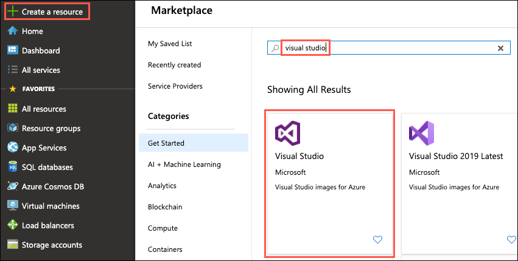
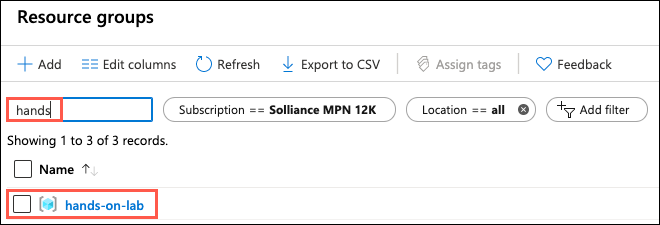
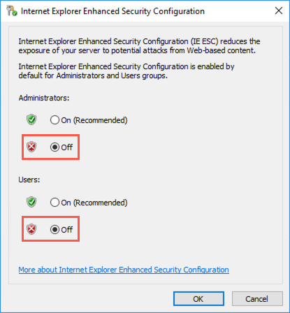

# Before the hands-on lab

Duration: 20 minutes

In the Before the hands-on lab exercise, you will set up your environment for use in the rest of the hands-on lab. You should follow all the steps provided in the Before the hands-on lab section to prepare your environment **before attending** the hands-on lab. Failure to do so will significantly impact your ability to complete the lab within the time allowed.

> IMPORTANT: Most Azure resources require unique names. Throughout this lab you will see the word “SUFFIX” as part of resource names. You should replace this with your Microsoft alias, initials, or another value to ensure the resource is uniquely named.

## Contents

* [Task 1: Provision a resource group](#task-1-provision-a-resource-group)
* [Task 2: Setup lab virtual machine](#task-2-setup-lab-virtual-machine)
* [Task 3: Connect to your Lab VM](#task-3-connect-to-your-lab-vm)
* [Next steps](#next-steps)

## Task 1: Provision a resource group

In this task, you will create an Azure resource group for the resources used throughout this lab.

1. In the [Azure portal](https://portal.azure.com), select **Resource groups**, select **+Add**, then enter the following in the Create an empty resource group blade:

    * **Name**: Enter hands-on-lab-SUFFIX

    * **Subscription**: Select the subscription you are using for this hands-on lab

    * **Resource group location**: Select the region you would like to use for resources in this hands-on lab. Remember this location so you can use it for the other resources you'll provision throughout this lab.

        

2. Select **Create**.

## Task 2: Setup lab virtual machine

In this task, you will provision a virtual machine (VM) in Azure. The VM image used will have Visual Studio Community 2017 installed.

1. In the [Azure portal](https://portal.azure.com/), select **+Create a resource**, enter "visual studio community" into the Search the Marketplace box, select **Visual Studio Community 2017 (latest release) on Windows Server 2016 (x64)** from the results, and select **Create**.

    

2. Set the following configuration on the Basics tab.

    * **Name**: Enter LabVM

    * **VM disk type**: Select SSD

    * **User name**: Enter demouser

    * **Password**: Enter Password.1!!

    * **Subscription**: Select the same subscription you are using for this hands-on lab

    * **Resource Group**: Select Use existing, and select the hands-on-lab-SUFFIX resource group

    * **Location**: Select the location you are using for resources in this hands-on lab

        

    * Select **OK** to move to the next step.

3. On the Choose a size blade, select DS2_V3 Standard.

    

4. Select **Select** to move on to the Settings blade.

5. Accept all the default values on the Settings blade, and select **OK**.

6. Select **Create** on the Create blade to provision the virtual machine.

7. It may take 10+ minutes for the virtual machine to complete provisioning.

## Task 3: Connect to your Lab VM

In this task, you will create an RDP connection to your Lab virtual machine (VM), and disable Internet Explorer Enhanced Security Configuration.

1. In the [Azure portal](https://portal.azure.com), select **Resource groups** in the Azure navigation pane, enter your resource group name (hands-on-lab-SUFFIX) into the filter box, and select it from the list.

    

2. In the list of resources for your resource group, select the LabVM Virtual Machine.

    

3. On your Lab VM blade, select Connect from the top menu.

    

4. Select **Download RDP file**, then open the downloaded RDP file.

    

5. Select **Connect** on the Remote Desktop Connection dialog.

    

6. Enter the following credentials when prompted:

    a. **User name**: demouser

    b. **Password**: Password.1!!

7. Select **Yes** to connect, if prompted that the identity of the remote computer cannot be verified.

    

8. Once logged in, launch the **Server Manager**. This should start automatically, but you can access it via the Start menu if it does not start.

    

9. Select **Local Server**, then select **On** next to **IE Enhanced Security Configuration**.

    

10. In the Internet Explorer Enhanced Security Configuration dialog, select **Off under Administrators**, then select **OK**.

    

11. Close the Server Manager.

*These steps should be completed prior to starting the rest of the Lab.*

## Next steps

You are now ready to complete the hands-on lab. Select a guide below to get started, or you can return to the overview page for the lab.

* Complete Hands-on lab
  * [Step-by-step guide](./HOL-step-by-step-Intelligent-vending-machines.md)
  * [Unguided guide](./HOL-unguided-Intelligent-vending-machines.md)
* Return to [Hands-on lab readme](./readme.md)