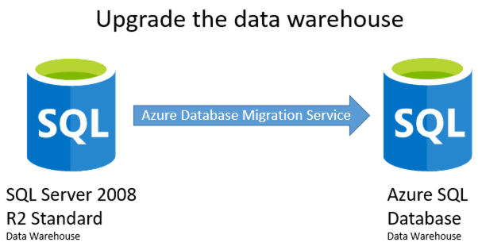
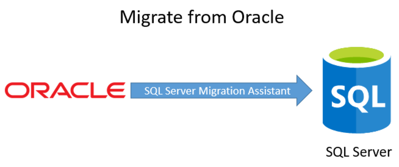

Data Platform upgrade and migration

Whiteboard design session trainer guide

November 2019

Information in this document, including URL and other Internet Web site references, is subject to change without notice. Unless otherwise noted, the example companies, organizations, products, domain names, e-mail addresses, logos, people, places, and events depicted herein are fictitious, and no association with any real company, organization, product, domain name, e-mail address, logo, person, place or event is intended or should be inferred. Complying with all applicable copyright laws is the responsibility of the user. Without limiting the rights under copyright, no part of this document may be reproduced, stored in or introduced into a retrieval system, or transmitted in any form or by any means (electronic, mechanical, photocopying, recording, or otherwise), or for any purpose, without the express written permission of Microsoft Corporation.

Microsoft may have patents, patent applications, trademarks, copyrights, or other intellectual property rights covering subject matter in this document. Except as expressly provided in any written license agreement from Microsoft, the furnishing of this document does not give you any license to these patents, trademarks, copyrights, or other intellectual property.

The names of manufacturers, products, or URLs are provided for informational purposes only and Microsoft makes no representations and warranties, either expressed, implied, or statutory, regarding these manufacturers or the use of the products with any Microsoft technologies. The inclusion of a manufacturer or product does not imply endorsement of Microsoft of the manufacturer or product. Links may be provided to third party sites. Such sites are not under the control of Microsoft and Microsoft is not responsible for the contents of any linked site or any link contained in a linked site, or any changes or updates to such sites. Microsoft is not responsible for webcasting or any other form of transmission received from any linked site. Microsoft is providing these links to you only as a convenience, and the inclusion of any link does not imply endorsement of Microsoft of the site or the products contained therein.

© 2019 Microsoft Corporation. All rights reserved.

Microsoft and the trademarks listed at <https://www.microsoft.com/en-us/legal/intellectualproperty/Trademarks/Usage/General.aspx> are trademarks of the Microsoft group of companies. All other trademarks are property of their respective owners.

**Contents**

- [Data Platform upgrade and migration whiteboard design session trainer guide](#data-platform-upgrade-and-migration-whiteboard-design-session-trainer-guide)
- [Trainer information](#trainer-information)
  - [Role of the trainer](#role-of-the-trainer)
  - [Whiteboard design session flow](#whiteboard-design-session-flow)
  - [Before the whiteboard design session: How to prepare](#before-the-whiteboard-design-session-how-to-prepare)
  - [During the whiteboard design session: Tips for an effective whiteboard design session](#during-the-whiteboard-design-session-tips-for-an-effective-whiteboard-design-session)
- [Data Platform upgrade and migration whiteboard design session student guide](#data-platform-upgrade-and-migration-whiteboard-design-session-student-guide)
  - [Abstract](#abstract)
  - [Step 1: Review the customer case study](#step-1-review-the-customer-case-study)
    - [Customer situation](#customer-situation)
    - [Customer needs](#customer-needs)
    - [Customer objections](#customer-objections)
    - [Infographic for common scenarios](#infographic-for-common-scenarios)
  - [Step 2: Design a proof of concept solution](#step-2-design-a-proof-of-concept-solution)
  - [Step 3: Present the solution](#step-3-present-the-solution)
  - [Wrap-up](#wrap-up)
  - [Additional references](#additional-references)
- [Data Platform upgrade and migration whiteboard design session trainer guide](#data-platform-upgrade-and-migration-whiteboard-design-session-trainer-guide-1)
  - [Step 1: Review the customer case study](#step-1-review-the-customer-case-study-1)
  - [Step 2: Design a proof of concept solution](#step-2-design-a-proof-of-concept-solution-1)
  - [Step 3: Present the solution](#step-3-present-the-solution-1)
  - [Wrap-up](#wrap-up-1)
  - [Preferred target audience](#preferred-target-audience)
  - [Preferred solution](#preferred-solution)
  - [Checklist of preferred objection handling](#checklist-of-preferred-objection-handling)
  - [Customer quote (to be read back to the attendees at the end)](#customer-quote-to-be-read-back-to-the-attendees-at-the-end)

# Data Platform upgrade and migration whiteboard design session trainer guide

# Trainer information

Thank you for taking time to support the whiteboard design sessions as a trainer!

## Role of the trainer

An amazing trainer:

- Creates a safe environment in which learning can take place.

- Stimulates the participant's thinking.

- Involves the participant in the learning process.

- Manages the learning process (on time, on topic, and adjusting to benefit participants).

- Ensures individual participant accountability.

- Ties it all together for the participant.

- Provides insight and experience to the learning process.

- Effectively leads the whiteboard design session discussion.

- Monitors quality and appropriateness of participant deliverables.

- Effectively leads the feedback process.

## Whiteboard design session flow

Each whiteboard design session uses the following flow:

**Step 1: Review the customer case study (15 minutes)**

**Outcome**

Analyze your customer's needs.

- Customer's background, situation, needs and technical requirements

- Current customer infrastructure and architecture

- Potential issues, objectives and blockers

**Step 2: Design a proof of concept solution (60 minutes)**

**Outcome**

Design a solution and prepare to present the solution to the target customer audience in a 15-minute chalk-talk format.

- Determine your target customer audience.

- Determine customer's business needs to address your solution.

- Design and diagram your solution.

- Prepare to present your solution.

**Step 3: Present the solution (30 minutes)**

**Outcome**

Present solution to your customer:

- Present solution

- Respond to customer objections

- Receive feedback

**Wrap-up (15 minutes)**

- Review preferred solution

## Before the whiteboard design session: How to prepare

Before conducting your first whiteboard design session:

- Read the Student guide (including the case study) and Trainer guide.

- Become familiar with all key points and activities.

- Plan the point you want to stress, which questions you want to drive, transitions, and be ready to answer questions.

- Prior to the whiteboard design session, discuss the case study to pick up more ideas.

- Make notes for later.

## During the whiteboard design session: Tips for an effective whiteboard design session

**Refer to the Trainer guide** to stay on track and observe the timings.

**Do not expect to memorize every detail** of the whiteboard design session.

When participants are doing activities, you can **look ahead to refresh your memory**.

- **Adjust activity and whiteboard design session pace** as needed to allow time for presenting, feedback, and sharing.

- **Add examples, points, and stories** from your own experience. Think about stories you can share that help you make your points clearly and effectively.

- **Consider creating a "parking lot"** to record issues or questions raised that are outside the scope of the whiteboard design session or can be answered later. Decide how you will address these issues, so you can acknowledge them without being derailed by them.

***Have fun**! Encourage participants to have fun and share!*

**Involve your participants.** Talk and share your knowledge but always involve your participants, even while you are the one speaking.

**Ask questions** and get them to share to fully involve your group in the learning process.

**Ask first**, whenever possible. Before launching into a topic, learn your audience's opinions about it and experiences with it. Asking first enables you to assess their level of knowledge and experience, and leaves them more open to what you are presenting.

**Wait for responses**. If you ask a question such as, "What's your experience with (fill in the blank)?" then wait. Do not be afraid of a little silence. If you leap into the silence, your participants will feel you are not serious about involving them and will become passive. Give participants a chance to think, and if no one answers, patiently ask again. You will usually get a response.

# Data Platform upgrade and migration whiteboard design session student guide

## Abstract

In this whiteboard design session, you work with a group to design a proof of concept (POC) for conducting a site analysis for a customer to compare cost, performance, and level of effort required to migrate from Oracle to SQL Server. You evaluate the dependent applications and reports that need to be updated and come up with a migration plan. Also, you review ways to help the customer take advantage of new SQL Server features to improve performance and resiliency, as well as explore ways to migrate from an old version of SQL Server to the latest version and consider the impact of migrating from on-premises to the cloud.

At the end of this whiteboard design session, you will be better able to design a database migration plan and implementation.

## Step 1: Review the customer case study

**Outcome**

Analyze your customer’s needs.

Timeframe: 15 minutes

Directions: With all participants in the session, the facilitator/SME presents an overview of the customer case study along with technical tips.

1. Meet your table participants and trainer.

2. Read all of the directions for steps 1-3 in the student guide.

3. As a table team, review the following customer case study.

### Customer situation

World Wide Importers (WWI) has experienced massive growth over the last few years. That growth has resulted in a tremendous influx of new data they need to maintain their business. This data has become increasingly expensive to store in an Oracle relational database management system (RDBMS). Oracle upgrades are tedious and expensive projects. Business stakeholders have tired of the process and have requested a proof of concept (POC) for replacing Oracle with Microsoft SQL Server.

WWI is investigating ways to improve the performance of their transactional databases without incurring expensive new license fees. They're also concerned with keeping their transactional system available and online for their store. They've noticed that Oracle has been slowing down as their growth has doubled. They realize that they would need to invest in new hardware to achieve this on-premises and, as a result, are looking at this as more of a migration to a new system.

WWI has several external and internal applications that need to migrate with the database. The database is used by an online store application, written in ASP.NET MVC. They also have internal applications that manage their product catalog, written in Oracle Forms. In addition, they have many reports to aid in forecasting, sales reporting, and inventory maintenance. Those reports are a mixture of SQL Server Reporting Services (SSRS), Excel, and Oracle Forms and hit the Oracle OLTP database directly.

WWI also uses this database to interact with vendors. Several of their vendors require real-time access to their sales data through an API so they can draw warranty information on the date of sale. They do this through a Representational State Transfer (REST) service that is maintained by WWI.

WWI also loads the Oracle database into a Microsoft SQL Server 2008 R2 Standard Edition data warehouse. The head of IT consistently fails an audit because their data warehouse does not provide encryption of data at rest. He is also aware that the extended support period for SQL Server 2008 R2 has passed, which translates into more security, compliance, and audit implications. He realizes he needs to upgrade to Azure SQL Database or SQL Server Enterprise Edition and would like to include an upgrade in the POC.

Before WWI invests in this project, they want a proof of concept that encompasses these touchpoints and proves that it can be successful.

WWI also has a new requirement. They have an existing web service that interacts with a vendor to get the latest certifications of that vendor's products. The JSON parser sometimes fails, and they can't figure out why. They'd like to store the original, unparsed JSON in a table for troubleshooting purposes. They would like to be able to query the JSON data by date or other identifying pieces of the JSON that might be available for troubleshooting and are interested in learning more about the best way to do that.

Also, they had a significant outage last year because one of their audit tables ran out of space. They had to wait many hours to resolve the issue while their IT department scrambled to make space on an already overloaded Storage Area Network (SAN). They would like a full briefing on how to monitor that situation, so it doesn't happen again, and possible remedies if it does happen again. They would also like high availability to be built into the project plan and are wondering what additional fees that would incur.

Kathleen Sloan, the CIO of WWI, is looking to decrease their software license fees, take advantage of a modern data warehouse, and provide a strong vision of availability for the future that can handle their momentous growth. She is sold on SQL Server, but her Oracle DBAs keep telling her that migration to SQL Server is simply impossible. They cite that they have never done it before. They say it's hard to find tools that make it possible. The Oracle DBAs say that SQL Server is not as high performing as Oracle, does not have great high availability like Oracle Real Application Clusters (RAC), and doesn't have a replacement for Oracle Forms. She's tired of hearing "no" whenever the topic is brought up and would love to prove them wrong. She is also exploring the cloud and is wondering if she can make a direct migration to a cloud database or if she must stay on-premises because of her requirements. She has seen SQL Server make tremendous gains in features over the last several versions, particularly in business intelligence. Her data warehouse has slowed down as the data has increased. On the one hand, this is because the data warehouse SQL Server has gotten very popular, but it's still considered a negative in her mind. She's concerned about the upgrade path because of all the dependencies on the data warehouse in her organization.

### Customer needs

1. Wants to migrate an existing Oracle database to SQL Server 2017 on-premises, SQL Server 2017 in an Azure VM, or Azure SQL Database.

2. Needs to know what's involved in migrating the external sales application to SQL Server.

3. Wants a better understanding of what to do with the internal Oracle Forms application.

4. Has multiple touchpoints with external vendors and wants to know what needs to change with those web services.

5. Wants to upgrade their existing data warehouse from SQL Server 2008 R2 Standard Edition to Azure SQL Database or SQL Server 2017 Enterprise Edition to take advantage of some new features:

   - They want Transparent Data Encryption (TDE), so they pass audits when asked if they encrypt data at rest.
   - They want compression for some of their large fact tables.
   - They want to implement SSRS mobile reporting.
   - They heard about in-memory structures and are wondering if they can benefit from those. They aren't entirely sure how it is different from what they are using now.
   - They have a lot of SQL Server Integration Services (SSIS) packages that execute through SQL Server Agent jobs. They'd like to know the upgrade path for those.

6. Need web-based visualizations on sales and forecasting, and a plan on how to upgrade their existing reporting infrastructure.

7. Have a new requirement on what to do with JSON data.

8. They experienced an outage last year and are hyper concerned with not repeating that experience. The audit table filled up, and they ran out of disk space. They'd like to know what would have happened if SQL Server experienced the same issue and what your solution would be.

9. As a follow-up, they'd also like to know how to answer the Oracle DBA's allegation that SQL Server doesn't have an answer for Oracle RAC.

### Customer objections

1. Do we need to upgrade to on-premises SQL Server first or go can we go straight to Azure?

2. Can we have two proof of concepts that demonstrate both migrations?

3. Do we need to rewrite all our applications for SQL Server?

4. Do we need to rewrite all our reports for SQL Server?

5. Will our security migrate over from Oracle to SQL Server? How do we handle security in the new database?

6. Do we need to invest in a JSON storage system for the JSON data we're storing from our vendor's web service?

7. What will we do if our audit logs fill up again? Will SQL Server crash the same way Oracle did?

8. If we take advantage of new features, will our license costs keep ratcheting up and up? Will we have a dependable way of budgeting for this project?

9. Are there any Oracle features required by WWI for which SQL Server has no equivalent?

10. Do we need to tell all our vendors that we're changing databases, so their integrations work?

11. What might prevent us from upgrading our data warehouse to Azure SQL Database or SQL Server 2017 Enterprise?

12. When we upgrade the data warehouse, how will we keep all our connected dependencies updated?

13. What will happen with SSIS, SSRS, and SQL Server Analysis Services (SSAS)?

14. How will security and SQL Agent Jobs be migrated?

### Infographic for common scenarios

## Step 2: Design a proof of concept solution

**Outcome**

Design a solution and prepare to present the solution to the target customer audience in a 15-minute chalk-talk format.

Timeframe: 60 minutes

**Business needs**

Directions:  With all participants at your table, answer the following questions and list the answers on a flip chart:

1. Who should you present this solution to? Who is your target customer audience? Who are the decision makers?

2. What customer business needs do you need to address with your solution?

**Design**

Directions: With all participants at your table, respond to the following questions on a flip chart:

*High-level architecture*

1. Without getting into the details (they are addressed in the following sections), diagram your initial vision for handling the top-level requirements for data loading, data preparation, storage, high availability, application migration, and reporting. You will refine this diagram as you proceed.

2. What should be included in the POC?

3. How will SQL Server save them on licensing costs?

*Schema and data movement*

1. How would you recommend that WWI move their data and schema into SQL Server? What services would you suggest and what are the specific steps they would need to take to prepare the data, to transfer the data, and where would the loaded data land?

2. Update your diagram with the data loading process with the steps you identified.

*Application changes*

1. What product would you recommend to WWI to migrate their storefront MVC application to the new SQL Server database?

2. How would you migrate the Oracle Forms applications? How would you define success? Are there any technologies the customer needs to know?

3. What will you do about the vendor touchpoints? How will you recommend they store the JSON data?

*Data warehouse and reporting*

1. How can they discover which reports and Excel spreadsheets hitting the Oracle database need to be upgraded? What's a proper upgrade path?

2. What must change about the way WWI loads its data warehouse?

3. What components do they need to use to upgrade the SQL Server 2008 R2 data warehouse to Azure SQL Database or SQL Server 2017 Enterprise?

4. Identify the significant milestones of delivering an upgrade to Azure SQL Database or SQL Server 2017 Enterprise.

5. Are there any tools or processes that would make this easier? How does Azure Database Migration Service (DMS) compare to other Microsoft database migration tools, such as Database Migration Assistant (DMA) or SQL Server Migration Assistant (SSMA)?

6. What are the steps required to use the Azure Database Migration Service to perform a database migration?

7. What are the post-upgrade steps we should consider in the POC? How would this address their concerns?

*High Availability and Audit Table*

1. If our solution were SQL Server, what could WWI have done with the audit table when it filled up?

2. What are the SQL Server options for high availability?

*Azure SQL Database POC*

1. Should they move to on-premises first?

2. Is there any benefit to going straight to Microsoft Azure? Does Azure SQL Database take care of all their requirements?

3. Are there any questions we need to answer before we can begin a POC directly to Microsoft Azure?

**Prepare**

Directions: With all participants at your table:

1. Identify any customer needs that are not addressed with the proposed solution.

2. Identify the benefits of your solution.

3. Determine how you will respond to the customer's objections.

Prepare a 15-minute chalk-talk style presentation to the customer.

## Step 3: Present the solution

**Outcome**

Present a solution to the target customer audience in a 15-minute chalk-talk format.

Timeframe: 30 minutes

**Presentation**

Directions:

1. Pair with another table.

2. One table is the Microsoft team and the other table is the customer.

3. The Microsoft team presents their proposed solution to the customer.

4. The customer makes one of the objections from the list of objections.

5. The Microsoft team responds to the objection.

6. The customer team gives feedback to the Microsoft team.

7. Tables switch roles and repeat Steps 2-6.

## Wrap-up

Timeframe: 15 minutes

Directions: Tables reconvene with the larger group to hear the facilitator/SME share the preferred solution for the case study.

## Additional references

|   |   |
|----------|-------------|
| **Description** | **Links** |
| Oracle Database to SQL Server Migration Assistant | <https://msdn.microsoft.com/library/hh313159(v=sql.110).aspx/> |
| Azure SQL Database features | <https://docs.microsoft.com/azure/sql-database/sql-database-features/> <https://blogs.msdn.microsoft.com/datamigration/dma/> |
| SQL Server Stretch Database | <https://azure.microsoft.com/services/sql-server-stretch-database> |
| SQL Server JSON data | <https://msdn.microsoft.com/library/dn921897.aspx> |
| Older Oracle Forms Migration guide | <https://technet.microsoft.com/library/bb463141.aspx/> <https://www.microsoft.com/sql-server/sql-license-migration/> |
| Oracle License Assistance Program & Deployment Subsidies | <https://www.microsoft.com/sql-server/sql-license-migration/> |
| Data Migration Assistant blog | <https://blogs.msdn.microsoft.com/datamigration/dma/> <https://technet.microsoft.com/library/bb463141.aspx/> |
| Database Experimentation Assistant (DEA) | <https://blogs.msdn.microsoft.com/datamigration/2016/10/24/database-experimentation-%20assistant-v1-0-preview> |
| SQL Server CLR strict security | <https://docs.microsoft.com/sql/database-engine/configure-windows/clr-strict-security> |
| Azure Database Migration Service Overview | <https://docs.microsoft.com/azure/dms/dms-overview> |
| SQL Server database migration to Azure SQL Database | <https://docs.microsoft.com/en-us/azure/sql-database/sql-database-cloud-migrate> |
| Differentiating Microsoft's database migration tools | <https://blogs.msdn.microsoft.com/datamigration/2017/10/13/differentiating-microsofts-database-migration-tools-and-services/> |

# Data Platform upgrade and migration whiteboard design session trainer guide

## Step 1: Review the customer case study

- Check in with your table participants to introduce yourself as the trainer.

- Ask, "What questions do you have about the customer case study?"

- Briefly review the steps and timeframes of the whiteboard design session.

- Ready, set, go! Let the table participants begin.

## Step 2: Design a proof of concept solution

- Check in with your tables to ensure that they are transitioning from step to step on time.

- Provide some feedback on their responses to the business needs and design.

  - Try asking questions first that will lead the participants to discover the answers on their own.

- Provide feedback for their responses to the customer's objections.

  - Try asking questions first that will lead the participants to discover the answers on their own.

## Step 3: Present the solution

- Determine which table will be paired with your table before Step 3 begins.

- For the first round, assign one table as the presenting team and the other table as the customer.

- Have the presenting team present their solution to the customer team.

  - Have the customer team provide one objection for the presenting team to respond to.

  - The presentation, objections, and feedback should take no longer than 15 minutes.

  - If needed, the trainer may also provide feedback.

## Wrap-up

- Have the table participants reconvene with the larger session group to hear the facilitator/SME share the following preferred solution.

## Preferred target audience

- Kathleen Sloan, CIO of World Wide Importers (WWI)

- The primary audience is business and technology decision-makers. From the case study scenario, it would include the Director of Analytics. Usually we talk to the infrastructure managers who report to the chief information officers (CIOs), or to application sponsors, such as a line of business (LOB) vice president (VP), chief marketing officer (CMO), or to those who represent the business unit IT or developers who report to application sponsors.

## Preferred solution

*High-level architecture*

1. Without getting into the details (they are addressed in the following sections), diagram your initial vision for handling the top-level requirements for data loading, data preparation, storage, high availability, application migration, and reporting. You will refine this diagram as you proceed.

    After speaking with its support team at Microsoft, WWI decided that SQL Server 2017 on-premises would be the right choice for the Oracle OLTP replacement. They decided to load data and schema using the SQL Server Migration Assistant, and migrate their Oracle Forms application to Microsoft ASP.NET Core. They are very concerned about how to do this and what method to use. They are leaning towards a total rewrite to ASP.NET Core. They would like the POC to include this. The POC should demonstrate that AlwaysOn Availability Groups provide them the reliability and performance they expected Oracle to deliver for them. They would also like to migrate their data warehouse to Azure SQL Database, allowing them to continue to grow the amount of data stored there more easily in the future.

    The solution they've decided on, at a high level, appears as follows:

    ![This solution diagram is divided into Microsoft Azure and on-premises. Microsoft Azure includes SQL Server 2017 in a VM as an AlwaysOn Secondary, and Azure SQL Stretch Database to extend the audit table to Azure. On-premises includes the following elements: API App for vendor connections; Web App for Internet Sales Transactions; ASP.NET Core App for inventory management; SQL Server 2017 OLTP for AlwaysOn and JSON store; SSRS 2017 for Reporting of OLTP, Data Warehouse, and Cubes; SSIS 2017 for a Data Warehouse Load; Excel for reporting; SQL Server 2017 Enterprise for a Data Warehouse; and SSAS 2017 for a Data Warehouse.](./media/preferred-solution-architecture.png "Preferred Solution diagram")

    **Diagram of possible architecture:**

    ![The possible architecture includes: Web App for Internet Sales Transactions; two SQL Servers (2009 R2 Standard and 2017 Enterprise) that are data warehouses and that are connected; Excel for reporting; An Oracle DB OLTP RAC server that is connected to a SQL Server 2017 OLTP always on and JSON store; and an Oracle Forms App and ASP.NET Core App for inventory management, and that are connected. A second box lists Upgrade, Change Connection Strings, Rewrite DataSets for OLTP, and Redeploy. Three icons display for SSIS 2008 data warehouse load, SSRS 2008 for Reporting of OLTP, Data warehouse, and cubes, and SSAS 2008 data warehouse.](media/possible-architecture.png "Possible architecture")

    **Diagram of how moving pieces will change during the Oracle to SQL Server migration, and SQL Server 2017 Upgrade for the data warehouse:**

    

    

    **Products that can be used to migrate specific products:**

    ")

    **Diagram of possible disaster recovery solution feature AlwaysOn Available Groups. The diagram emphasizes a secondary replica in Microsoft Azure:**

    

    **Diagram of an example Oracle Forms migration to VB.NET windows application (not WPF):**

    This diagram shows some of the components that might be in an Oracle Forms project, including menus, control blocks, and a PL/SQL module and the corresponding projects that can be chosen for those components. It's not necessary to understand all components of Oracle Forms, only to know that it's possible to rewrite the application while maintaining a similar structure, if desired.

    ![This is a diagram of an Example Oracle Forms migration to VB.NET windows application. On the left, the Oracle Forms Application includes an Oracle server, an Oracle module (Data block and control block), and Oracle Forms (menu module, PL/SQL library module, and object library module). On the right, a VB.NET Windows Application includes a VB.NET Windows Application project, which encompasses a menu, and WinForm (Databound Controls, and non-databound controls). In addition, below the project are two separate VB.NET Class Library Projects. The Oracle Forms PL/SQL Library module points to one, and the Object library module points to the other. The Oracle Menu Module points to VB.NET Menu, the Oracle Control block points to Non-databound controls, and the Oracle Data block passes through a DataSet/ DataReader / Command to the Databound controls. Between the two columns a SQL Server with ADO.NET connects through DataSet / DataReader / Command to VB.NET Class Library Project.](media/oracle-forms-migration.png "Example Oracle Forms migration to VB.NET windows application")

2. What should be included in the PoC?

    For the POC we should include the following:

    - An MVC app that changes connectionString from Oracle to SQL Server in Entity Framework.

    - A basic form that mirrors what's in the Oracle Forms application.

    - The current Oracle database migrated to SQL Server 2017 Enterprise in a test environment.

    - An upgraded data warehouse using Azure Database Migration Service, including:
      - Upgraded SSIS, SSAS, and SSRS projects.

    - Testing repointing some of the Excel worksheets to a new test data warehouse.

    - Implement new features in the new OLTP SQL Server database including:
        - JSON Data Store
        - SQL Server Stretch Database
        - AlwaysOn Availability Groups

    - Implement new features in the new Azure SQL Database data warehouse features:
        - Table Compression
        - Transparent Data Encryption
        - Clustered ColumnStore Indexing

3. How will SQL Server save them on licensing costs?

    Microsoft offers license assistance programs for current Oracle users, which can include free licenses to current Oracle customers. They can also subsidize the cost of the migration process.

    Also, SQL Server tends to be about 25% of the licensing costs of Oracle. Oracle charges for individual features, such as Oracle RAC. Microsoft SQL Server only has two real pricing tiers, Standard Edition and Enterprise Edition. With SQL Server 2017 Consistent Programming Surface Area, SQL Server licensing has gotten even more straightforward, while Oracle's licensing is still getting more complicated. Now there are many Enterprise features of SQL Server that have pushed down to Standard Edition, including ColumnStore indexing. This should improve performance without significantly increasing costs. SQL Server also offers free licenses for pre-deployment environments, including development and test environments. Oracle charges for these licenses.

    Oracle upgrades also need Oracle consultants, meaning they take longer, and the consultants charge higher rates. Overall maintenance costs are much higher. These soft changes add to the overall cost of ownership for Oracle environments. These costs should decrease dramatically in a SQL Server environment.

    At the time of this writing, for Enterprise versions, SQL Server is about \$14,256 per core retail, while Oracle is \$47,500 per core. That's a significant cost saving.

    > **Note**: The preferred solution is only one of many possible, viable approaches.

*Schema and data movement*

1. How would you recommend that WWI move their data and schema into SQL Server? What services would you suggest and what are the specific steps they would need to take to prepare the data, to transfer the data, and where would the loaded data land?

    SQL Server Migration Assistant (SSMA) was explicitly created and supported by Microsoft to help Oracle customers move their schema and data over to Microsoft SQL Server. First, you create a new project. Then you connect to the Oracle source database. Then connect to the SQL Server destination database. Map Oracle schemas to SQL Server schemas. Then you can load the Oracle schemas into the SQL Server schemas. Before synchronizing the objects into the SQL Server database, the SSMA for Oracle assemblies must be marked as trusted assemblies so that the synchronization can complete successfully. Once that is completed, synchronize all the objects. Lastly, you can move all the data into SQL Server.

    You can also use SSMA to create scripts that you can modify by hand if you're more comfortable looking at the objects one at a time.

    You can also use SSMA to migrate the schema only, and then use another tool to load the data, like SSIS. This approach could be a better option if you are planning to run both databases in tandem with each other.

2. Update your diagram for the data loading process with the steps you identified.

    See the diagram provided under High-level architecture.

*Application changes*

1. What product would you recommend to WWI to migrate their storefront MVC application to the new SQL Server database?

    A specific product might not be needed, but you might evaluate whether they are using an object relational mapping (ORM) tool or not. If they are using Entity Framework, Dapper, or nHibernate, then the application should migrate much more easily.

    If they didn't use an ORM, then much of the data-layer code will need to be rewritten. If this code is consolidated, and only plain old CLR objects (POCOs) are being handed back using the repository pattern, then we might be able to replace the entire tier with Entity Framework or another ORM. If there has been bleeding between the layers, then this process might be significantly more difficult. The entire storefront application would need to be refactored and tested eventually. For the POC, they are looking to switch the connection string, test several pages related to an order, and get a good idea on the work that would be necessary to get that to work.

2. How would you migrate the Oracle Forms applications? How would you define success? Are there any technologies the customer needs to know?

    The Oracle Forms application needs to be completely rewritten. There is guidance from Microsoft on how to do that to Visual Basic.NET. There are third-party tools that will attempt to automatically rebuild an Oracle Forms application to Windows Presentation Foundation (WPF) and Model-View-ViewModel (MVVM). You can also rewrite this by hand into any technology the client would like.

    Oracle Forms applications cannot be easily cloud-hosted. This application would eventually need to be rewritten if they'd like new experiences like a mobile experience, a tablet application, or hosted in Microsoft Azure.

3. What will you do about the vendor touchpoints? How will you recommend they store the JSON data?

    The REST services need to be approached the same way the MVC storefront application is approached. If they've used an ORM, then we can repoint the connectionStrings and redeploy.

    JSON data can be stored in a `varchar` field in SQL Server and managed through the JSON functions of SQL Server 2017. They can be queried and indexed through the JSON features, also.

    The REST services need to be approached the same way the MVC storefront application is approached. If they've used an ORM, then it is likely we can repoint the connectionStrings and redeploy.

*Data warehouse and reporting*

1. How can they discover which reports and Excel spreadsheets hitting the Oracle database need to be upgraded? What's a proper upgrade path?

   There's an Oracle Profiler API that can be used to store trace information into tables. These tables can be queried to see if we've identified all reports and artifacts that we need to upgrade.

    We can put individual queries into stored procedures and upgrade them using SSMA. We can also use SSMA to upgrade individual queries to T-SQL.

2. What must change about the way WWI loads its data warehouse?

    We need to identify all the extract, transform, and load (ETL) packages that load data from Oracle to SQL Server. We will upgrade all the connection strings to load the data warehouse from the new SQL Server OLTP database to the Azure SQL Database data warehouse. We will have to change all the data source connections to Azure SQL Database. If collation is different, we will need to address that with data conversion tasks in the data flow.

3. What components do they need to use to upgrade the SQL Server 2008 R2 data warehouse to Azure SQL Database or SQL Server 2017 Enterprise?

    We must account for SQL Server security, SQL Server agent jobs, and external applications that might be hitting the engine and SSAS.

    SSRS, SSAS, and SSIS will need to be upgraded and redeployed. All developers who are using BI tools will need to upgrade to the latest versions of SQL Server Management Studio (SSMS) and SQL Server Data Tools (SSDT).

4. Identify the significant milestones of delivering an upgrade to Azure SQL Database or SQL Server 2017 Enterprise.

    A proper upgrade plan might look something like this:

    - Assess
        - Identify and Understand the required changes.
        - Understand how to leverage new features.
    - Plan
        - When can I perform the migration?
        - How will I apply the required fixes?
    - Migrate
        - Perform schema and data movement.
        - Execute post-migration fixes.

5. Are there any tools or processes that would make this easier? How does Azure Database Migration Service (DMS) compare to other Microsoft database migration tools, such as Database Migration Assistant (DMA) or SQL Server Migration Assistant (SSMA)?

    The Azure Database Migration Service is the preferred method for database migration to Microsoft Azure at scale.

    - Supports migration of SQL Server or Oracle on-premises databases to Azure SQL Database and Azure SQL Database Managed Instance.
    - Represents a fully managed database migration service for both operational databases and data warehouses.
    - It provides a resilient and reliable migration pipeline that requires minimal user involvement during the overall migration process.
    - It is recommended for large (in terms of number and size of databases) migrations – DMS can migrate databases at scale.

    Microsoft's Data Migration Assistant can be used to upgrade the SQL Server data warehouse. That tool can not only upgrade the data and schema in the database, but the SSIS database (if there is one), SQL Logins, SQL Agent Jobs, and SSIS packages.

    SQL Server Migration Assistant supports complete migration from Oracle, MySQL, SAP, ASE, DB2, and Access to SQL Server 2008+ and Azure SQL Database. This allows users to convert a database schema to a Microsoft SQL Server schema, upload the schema, and then migrate data to the target SQL Server.

    When doing the assessment, WWI can choose which Compatibility Level they want to target- so they don't need to jump all the way forward to the very latest level right away. This can help reduce the number of blocking issues they need to address manually before starting the migration.

6. What are the steps required to use the Azure Database Migration Service to perform a database migration?

    During a typical, simple database migration, you:
    - Create a target database(s).
    - Migrate the database(s) schema by using the Database Migration Assistant.
    - Create an instance of the Azure Database Migration Service.
    - Create a migration project specifying the source database(s), target database(s), and tables to migrate.
    - Initiate the full load.
    - Pick the subsequent validation.
    - Perform a manual switch-over of your production environment to the new cloud-based database.

7. What are the post-upgrade steps we should consider in the POC? How would this address their concerns?

    The Data Migration Assistant report, which is exported to a CSV file, should be reviewed for post-migration tasks identified by the Data Migration Assistant.

    After the upgrade, they need to implement Transparent Data Encryption quickly. This might complicate their populating test servers because a certificate and password are necessary to move the database to a new server.

    They can immediately implement table compression in a test environment. Compression might put a load on their processor, but they should notice a significant performance increase related to disk I/O. Compressing the large fact tables and large dimension tables should improve performance.

    Once installed, they can begin to experiment with SSRS mobile reporting and Power BI.

    They should test if they get a performance increase by creating clustered ColumnStore indexes. Particularly, they should test their ETL processes.

    The customer cited concerns with a slow data warehouse. Implementing compression and ColumnStore clustered indexes will likely alleviate performance issues. Transparent Data Encryption will help them pass their audits.

    Also, consider using the Database Experimentation Assistant to prove that these changes have improved the query performance of the SQL Server data warehouse.

*High Availability and Audit Table*

1. If our solution were SQL Server, what could WWI have done with the audit table when it filled up?

    Implement SQL Server Stretch Database to grow the audit table while we worked on a long-term solution.

    There are other possible answers below:

    - Use views to extend the table to another drive. Create a view with the original table name. Have two tables behind it, one on each different drive. Use instead of triggers to intercept the inserts, and in the trigger, choose the active table.
    - Use table partitions and move a newer partition to a new drive.
    - Archive older records temporarily while we implement a longer-term solution.

2. What are the SQL Server options for high availability?

    SQL Server provides several options for creating high availability for a server or database. High-availability options include the following:

    - Failover clustering
    - Database mirroring
    - Log shipping
    - Replication
    - Scalable shared databases

*Azure SQL Database POC*

1. Should they move to on-premises first?

    This is a perfectly acceptable option. If we do, we might consider using AlwaysOn, and creating a copy of the data in Azure as an AlwaysOn Secondary. This would keep an active, current copy of the data in the cloud that we could use for Power BI, other Azure-based applications, or as part of a future Azure migration.

    Other on-premises applications might keep them on-premises until they can figure out how to move those applications to the cloud. It depends on the integration touchpoints, network latency needs, and reliable internet connectivity for all offices.

2. Is there any benefit to going straight to Microsoft Azure? Does Azure SQL Database take care of all of their requirements?

    If the organization has chosen to go to the cloud, this might be a long-term cost savings of skipping purchasing the on-premises hardware.

    If the applications are already cloud-born, or they have many external applications needing access, then this would not affect latency while removing the burden from WWI of maintaining the connectivity with all their integration partners.

    In addition, they would gain the benefit of simplifying future software upgrades, so the current investment in new hardware was necessary. Some of their products would upgrade and offer new features with minimal effort on their part.

3. Are there any questions we need to answer before we can begin a POC directly to Microsoft Azure?

    - What is network connectivity like between on-premises and the cloud?
    - What are our long-term cloud plans? Is there a mandate to go there regardless?
    - Where is the rest of the data integration points stored? Are they on-premises? Is anything in Microsoft Azure already?
    - Are there any cloud products that are already on the roadmap for the organization?

## Checklist of preferred objection handling

1. Do we need to upgrade to on-premises SQL Server first or go can we go straight to Azure?

    This is a joint business and technical decision. Azure SQL Database or Azure SQL in a VM will offer all the features they've stated that they need. There is a migration path to both.

    If they have a long-term strategy to move to the cloud, have already moved some resources there, have a plan to co-locate with a partner data center, or have identified cloud services they'd like to take advantage of, then moving straight to the cloud might be preferred.

    It might be easier to be on-premises if they don't have Express Route for their Excel spreadsheets and other on-premises resources that can't migrate to Azure quite yet.

2. Can we have two proofs-of-concept that demonstrate both migrations?

    Two proof-of-concepts are possible and easy to do. The application architecture might be quite a bit different if we choose to use Platform as a Service (PaaS). The online sales application and web services would migrate to Azure Websites. SSRS would have to migrate to a Virtual Machine (unless we use the SSRS Azure alpha release). The data warehouse likely can't move to the cloud without a significant investment. If it stays on-premises, then data movement from the new Azure OLTP database to the on-premises SQL Server 2017 Enterprise data warehouse would need to be addressed. Again, ExpressRoute might be needed.

3. Do we need to rewrite all our applications for SQL Server?

    The Oracle Forms application would have to be rewritten to ASP.NET Core or ASP.NET MVC. There are migration tools available to help from third-parties if they choose to migrate to ASP.NET MVC. Otherwise, the rewrite effort will need to be planned and implemented. For the POC, show a basic CRUD data entry form to show how the project would be structured. Use Entity Framework if appropriate to make the CRUD migration easier.

    If the existing ASP.NET MVC application that runs their storefront uses Entity Framework or another object-relational mapping (ORM) tool, then migration of that application is trivial. It's possible that we could repoint the connectionString, re-run the unit tests, and the application will just work. Blockers might be if Entity Framework is using Stored Procedures in Oracle. Those will need to be tested after we run the SQL Server Migration Assistant.

4. Do we need to rewrite all our reports for SQL Server?

    The SSRS reports should migrate over with just a change to the connectionString. The data sets might need SQL refreshed for T-SQL instead of PL/SQL.

    If the Excel reports use simple queries to views or stored procedures, then changing the connectionString might work with them, also. If not, then the queries that drive the spreadsheets will need to be rewritten. The SQL Server Migration Tool can also convert specific, individual queries from PL/SQL to T-SQL.

5. Will our security migrate over from Oracle to SQL Server? How do we handle security in the new database?

    Security roles, users, and permissions will need to be recreated. Schema can be mapped and migrated over to the new server.

6. Do we need to invest in a JSON storage system for the JSON data we're storing from our vendor's web service?

    JSON data can be stored in SQL Server as a `varchar` field. It can be queried and indexed using JSON keywords in T-SQL. It can be queried and flattened to be used in an SSRS report of bad data that didn't parse when we processed it with the web service (a customer concern they mentioned having previously).

7. What will we do if our audit logs fill up again? Will SQL Server crash the same way Oracle did?

    We can use SQL Server Stretch Database to extend the audit table to Azure. We can also partition big tables and put the new partition on a different drive that doesn't have space problems.

8. If we take advantage of new features, will our license costs keep ratcheting up and up? Will we have a dependable way of budgeting for this project?

    Microsoft offers license assistance programs for current Oracle users, which can include free licenses to current Oracle customers. They can also subsidize the cost of the migration process. SQL Server licensing also includes all available features in the Enterprise Edition with no additional cost for each feature implemented.

9. Are there any Oracle features required by WWI for which SQL Server has no equivalent?

    Nothing in the customer requirements is exclusive to an Oracle ecosystem. Oracle Forms is unique to Oracle, but Microsoft offers several replacement technologies, including LightSwitch, SharePoint Forms, Power Apps, ASP.NET MVC, WPF Forms, and ASP.NET Core applications.

    The customer might implement Oracle RAC, but AlwaysOn Availability Groups are easier to implement, cheaper, and have lower hardware requirements.

10. Do we need to tell all our vendors that we're changing databases, so their integrations work?

    As long as we test and refactor the web services they use, they shouldn't know that you switched your back-end data store.

11. What might prevent us from upgrading our data warehouse to Azure SQL Database or SQL Server 2017 Enterprise?

    Thought needs to be given to upgrading the database storage engine, SQL Server Analysis Services, SQL Server Reporting Services, and SQL Server Integration Services. SSRS and SSIS have been completely redone since SQL Server 2008, with new interfaces and new engines. SSAS multidimensional also has a new engine with a tabular engine. Thought needs to be given if it will be implemented.

12. When we upgrade the data warehouse, how will we keep all our connected dependencies updated?

    If we don't change the server name, our job is much easier. We might not even need to modify the connectionStrings. We can keep the server name the same by either doing an in-place upgrade or by migrating to a new server and then changing the name of the new server to a new name. If we migrate to a new server, we will need to migrate security logins and permissions, along with the database. We'll also need to script the SQL Server Agent jobs over to the new server.

13. What will happen with SSIS, SSRS, and SQL Server Analysis Services (SSAS)?

    Once the server is upgraded, we should redeploy the SSIS, SSAS, and SSRS projects after changing the connectionStrings. If we used project connectionStrings, this will be much easier. All external connections should be tested thoroughly.

    If we use Database Migration Assistant, SSIS packages will upgrade during the process and will migrate over to the new server.

14. How will security and SQL Agent jobs migrate?

    If we use Database Migration Assistant, security and the SQL Server Agent Jobs will migrate over to the new server.

## Customer quote (to be read back to the attendees at the end)

"We are excited that a SQL Server environment will help our organization grow and prosper for many years into the future."

Kathleen Sloan, CIO of World Wide Importers
